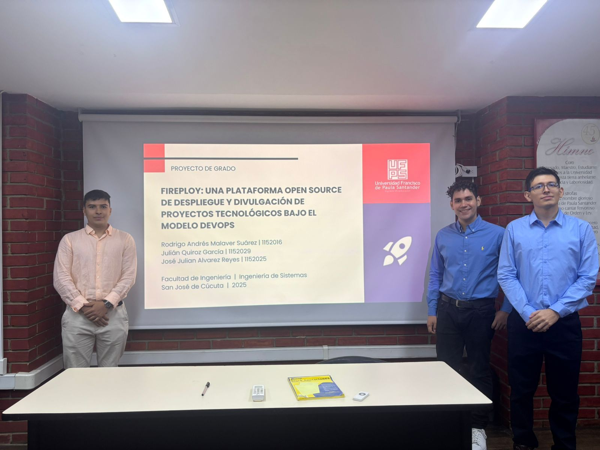

<!-- truncate -->

Te damos una cálida bienvenida a Fireploy 🚀

Fireploy es una plataforma Open Source diseñada para impulsar el despliegue y la divulgación de proyectos tecnológicos bajo el modelo de desarrollo DevOps. Nuestro objetivo es facilitar la presentación, automatización y gestión de portafolios tecnológicos a través de herramientas modernas y procesos estandarizados.

¿Por qué Fireploy? Porque creemos en la importancia de acercar las mejores prácticas de ingeniería de software a todos, promoviendo la adopción de metodologías que potencian la eficiencia y aceleran los ciclos de vida de los aplicativos web. Con Fireploy, los usuarios pueden configurar de manera automática instancias y proyectos, logrando que sus aplicaciones estén disponibles de forma sencilla, rápida y profesional.

Te damos la bienvenida a esta comunidad donde la innovación, la colaboración y el crecimiento profesional van de la mano. 🌐✨

Igualmente te agradecemos interesarte por nuestro software, es un profundo esfuerzo para ayudarte, y que hagas crecer tu entorno. 👨‍💻

