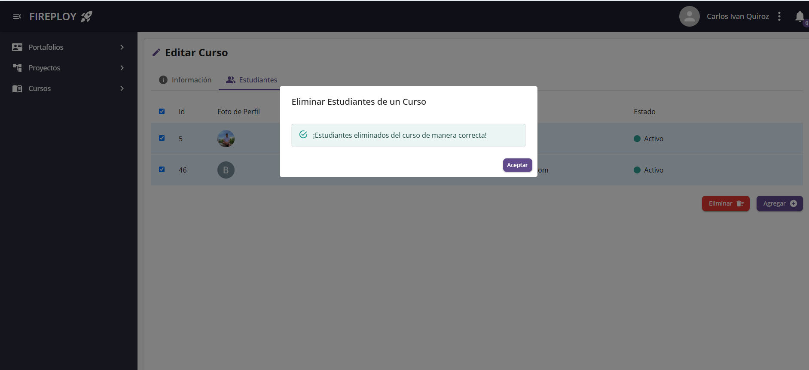
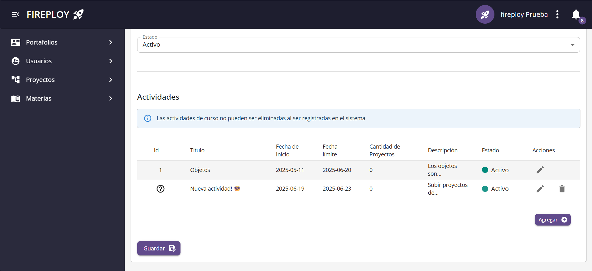

# Gestión de Cursos

Gestiona los cursos que se encuentran registrados en la plataforma. Estos cursos se asocian a las materias y son administrados por los docentes.

## Crear un curso

El administrador puede crear nuevos cursos de forma individual.

### Pasos para crear un curso

1. Desde la barra lateral, hacer clic en **Materias**.  
2. En la tabla de materias, hacer clic en el botón de **Editar** de la materia deseada.  
3. Se abre la vista de la materia con sus cursos.  
4. Hacer clic en **Agregar**.  
5. Se abre la vista de creación de curso.  
6. Completar los campos del formulario, los cuales se explican en [formulario de creación de curso](./index.md#formulario-de-creación-de-curso).  
7. Hacer clic en **Guardar**.  
8. El sistema mostrará un modal confirmando la creación del curso.

9. El nuevo curso se reflejará en la lista de cursos.  

### Formulario de creación de curso

| Campo         | Tipo de dato    | Obligatorio | Descripción                               |
|---------------|-----------------|-------------|-------------------------------------------|
| Identificador | Texto libre     | Sí          | Nombre o identificador del curso.         |
| Profesor      | Selección (user) | No          | Profesor asignado al curso.               |
| Descripción   | Texto largo     | No          | Descripción breve del curso.              |

---

## Editar un Curso

### Campos del Curso

| Campo           | Descripción                                                                 |
|-----------------|-----------------------------------------------------------------------------|
| **Grupo**       | Grupo asignado al curso (Ej: "A", "B").                                      |
| **Profesor**    | Nombre del profesor encargado (este campo ya aparece asignado automáticamente). |
| **Descripción** | Información breve del curso (máx. 500 caracteres).                  |
| **Estado**      | Define si el curso está **Activo** o **Inactivo**. Solo los cursos activos serán visibles. |

:::info Tip
Un curso inactivo no será mostrado a los estudiantes, pero puedes reactivarlo en cualquier momento.
:::

---

### Pasos del proceso

1. Ingresa al curso que desea modificar.

2. Haz clic en el botón **Editar**.

## Gestión de Estudiantes

En cada curso puedes **agregar** y **eliminar** estudiantes de forma sencilla.

### Agregar estudiantes

1. En la vista de edición del curso, selecciona la pestaña **Estudiantes**.

2. Presiona el botón de **Aceptar**.

3. Mediante el campo de ingreso, ingresa el nombre los estudiantes y selecciónalos.

4. Verás que el estudiante se agrega a la lista debajo.

5. Confirma la acción.

### Eliminar estudiantes

1. En la pestaña **Estudiantes**, ubica la lista de estudiantes ya agregados.
2. Selecciona aquellos que deseas eliminar.
3. Pulsa **Eliminar** para remover al estudiante del curso.
4. No olvides presionar **Guardar** para que se apliquen los cambios.

:::info Importante
Eliminar un estudiante de un curso no elimina su cuenta, solo lo desvincula de este curso en particular.
:::

---

## Gestionar de Actividades

### Campos de la Actividad

| Campo               | Descripción                                                              |
|---------------------|--------------------------------------------------------------------------|
| **Título**          | Nombre de la actividad (Ejemplo: "Actividad de Arreglos").                 |
| **Fecha de inicio** | Fecha desde la cual la actividad estará disponible para los estudiantes.  |
| **Fecha límite**    | Última fecha para entrega de la actividad.                                |
| **Descripción**     | Detalle o instrucciones de la actividad (máx. 500 caracteres).   |
| **Estado**          | Define si la actividad está **Activa** o **Inactiva**.                    |

:::note Importante
Solo las **actividades activas** son visibles para los estudiantes.  
Puedes modificar las fechas en cualquier momento.  
Una vez creada una actividad en el sistema, esta no puede eliminarse.
:::

### Crear una Actividad

1. Dentro de edición de un curso, situate en el apartado **Actividades**.

2. Haz clic en el botón **Crear**.

3. Guarda y confirma los cambios.

### Editar una Actividad

1. Dentro de edición de un curso, entra a la pestaña **Actividades**.

2. Selecciona la actividad que deseas editar.

3. Haz clic en el botón **Editar**.

4. Guarda y confirma los cambios.

---

### Habilitar o deshabilitar un curso

El administrador puede habilitar o deshabilitar un curso desde la vista de detalle de la materia en la tabla de cursos.

### Pasos para habilitar/deshabilitar un curso

1. Desde la vista de cursos, hacer clic en el botón de **Habilitar** o **Deshabilitar** correspondiente al curso.  
2. Se abrirá un modal de confirmación.  
3. Hacer clic en **Confirmar**.  
4. El sistema mostrará un modal confirmando la acción.

---

## Carga masiva de cursos

El sistema permite al administrador realizar la carga masiva de cursos mediante un archivo en formato `.xlsx`. Se adjunta un archivo de ejemplo: [Formato_cursos.xlsx](../../../static/files/formato_cursos.xlsx).

### Requisitos del archivo

- El archivo debe tener extensión `.xlsx`.  
- Las columnas mínimas recomendadas son:  
  - Nombre del curso  
  - Código del curso  
  - Estado (Activo/Inactivo)

:::note Nota

Es importante validar que el archivo no contenga datos duplicados o inconsistencias.

:::

### Pasos para la carga masiva

1. Desde cualquier **Listado de Cursos**, hacer clic en el botón **Carga Masiva** (parte inferior derecha).  
2. Se abrirá el explorador de archivos.  
3. Seleccionar el archivo `.xlsx` con los cursos.  
4. Se abrirá un modal de confirmación.  
5. Hacer clic en **Confirmar**.  
6. El sistema mostrará un modal confirmando la carga.

---
