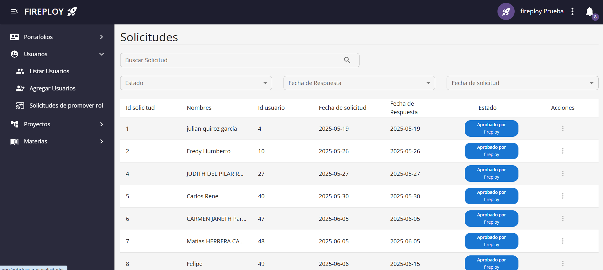
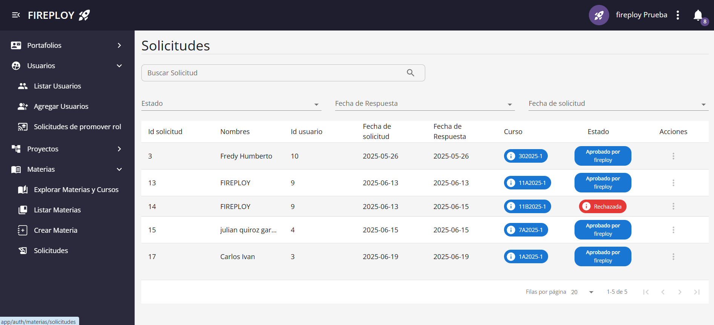
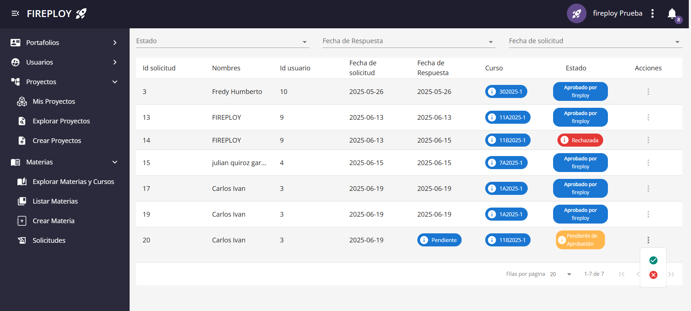
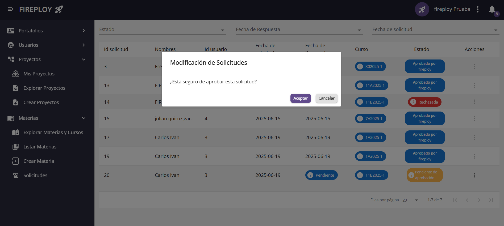
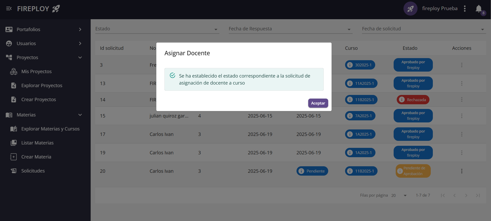
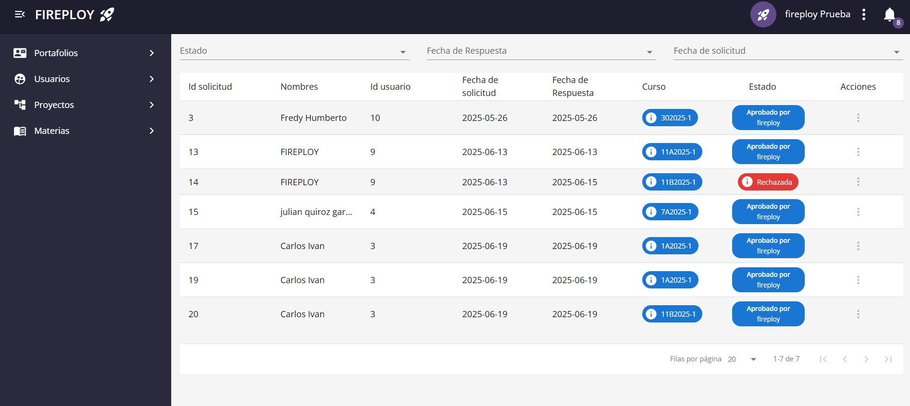

# Gestión de Solicitudes

En FIREPLOY existen **dos tipos de solicitudes** que los administradores deben gestionar fácilmente.

## Solicitudes de Promover Rol

Estas solicitudes son creadas por los usuarios que desean un **ascenso de rol** en la plataforma (por ejemplo, pasar de Estudiante a Profesor o de Usuario básico a Colaborador). Se accede mediante la opción **Solicitudes de Promover Rol** que se encuentra en el apartado **Usuarios**.

### Información mostrada en la tabla

| Columna                | Descripción                                 |
|------------------------|---------------------------------------------|
| Id solicitud           | Número único de la solicitud                 |
| Nombres                | Nombre del usuario solicitante               |
| Id usuario             | ID interno del usuario                       |
| Fecha de solicitud     | Fecha en la que se realizó la solicitud      |
| Fecha de respuesta     | Fecha en la que fue gestionada               |
| Estado                 | Estado actual (Aprobada, Rechazada, Pendiente) |
| Acciones               | Opciones para aprobar o rechazar             |

---

## Solicitudes de Materias y Cursos

Estas solicitudes son generadas por los usuarios que solicitan su **inscripción en un curso o materia**. Se accede mediante la opción **Solicitudes de Materias y Cursos** que se encuentra en el apartado **Materias**.

### Información mostrada en la tabla

| Columna                | Descripción                                 |
|------------------------|---------------------------------------------|
| Id solicitud           | Número único de la solicitud                 |
| Nombres                | Nombre del usuario solicitante               |
| Id usuario             | ID interno del usuario                       |
| Fecha de solicitud     | Fecha en la que se realizó la solicitud      |
| Fecha de respuesta     | Fecha en la que fue gestionada               |
| Curso                  | Código del curso solicitado                  |
| Estado                 | Estado actual (Aprobada, Rechazada)          |
| Acciones               | Opciones para aprobar o rechazar             |

## Estados posibles de las solicitudes
- ✅ **Aprobado**  
- ❌ **Rechazada**  
- **Pendiente**

## Responder Solicitud

1. Haz clic en el apartado de acciones de la correspondiente solicitud.
2. Acepta la ventana de confirmación.
3. Haz establecido un estado a la solicitud!

:::note Notas
    - El establecimiento de estados sobre la solicitud por parte del administrador no es modificable posteriormente.
    - Los usuarios pueden volver a realizar la misma solicitud solo cuando esta fue **Rechazada**.
:::

---

¡Con este panel, la gestión de solicitudes en FIREPLOY es rápida, intuitiva y eficiente! 🚀
