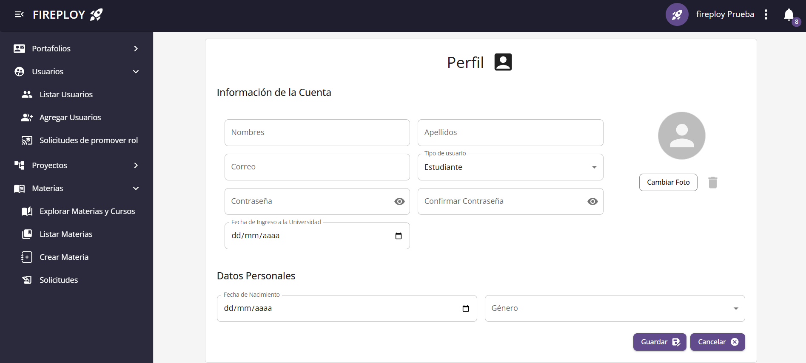

# Gestión de Usuarios

La sección de **Gestión de Usuarios** te permite crear, consultar y actualizar la información de los usuarios registrados en el sistema de forma sencilla.

---

## Agregar un nuevo usuario

### Campos del formulario

| Campo                                 | Descripción                                                                                                         | Obligatorio |
|---------------------------------------|---------------------------------------------------------------------------------------------------------------------|-------------|
| **Nombre**                            | Nombre personal del usuario.                                                                                        | ✅          |
| **Apellido**                          | Apellido personal del usuario.                                                                                      | ✅          |
| **Correo electrónico**                | Dirección de correo electrónico (único, en formato válido).                                                          | ✅          |
| **Sexo**                              | Género del usuario.                                                                                                 | ✅          |
| **Fecha de nacimiento**               | Fecha válida. El usuario debe tener al menos 16 años de edad.                                                        | ✅          |
| **Fecha de ingreso a la universidad** | Fecha en que el usuario ingresó a la universidad (solo se solicita para estudiantes).                                 | ✅          |
| **Contraseña**                        | Contraseña de acceso al sistema.                                                                                    | ✅          |
| **Confirmación de contraseña**        | Confirmación de la contraseña ingresada.                                                                            | ✅          |

### Pasos para agregar un usuario

1. Ingresa a la sección **Listar Usuarios** desde el menú principal.
2. Pulsa el botón **Agregar usuario**.
3. Completa el formulario con los campos indicados.
4. Haz clic en **Confirmar**.
5. El sistema mostrará un mensaje indicando que el usuario ha sido creado exitosamente y serás redirigido al menú principal.

---

## Visualizar usuarios

1. Desde el menú principal, accede a **Usuarios**.
2. Haz clic en **Listar usuarios**.
3. Se mostrará una tabla con todos los usuarios registrados en el sistema.

---

## Editar información de un usuario

1. En la lista de usuarios, selecciona el usuario que deseas editar.
2. Modifica los campos necesarios.
3. Pulsa **Guardar**.
4. El sistema te mostrará un mensaje de confirmación.

:::note Nota
  Este proceso es completamente análogo al de editar perfil.
:::

---

## Carga masiva de cursos

El sistema permite al administrador realizar la carga masiva de cursos mediante un archivo en formato `.xlsx`. Se adjunta un archivo de ejemplo: [Formato_usuarios.xlsx](../../../../../static/files/formato_usuarios.xlsx).

### Requisitos del archivo

- El archivo debe tener extensión `.xlsx`.  
- Las columnas mínimas recomendadas son:  
  - Nombre
  - Apellido
  - Fecha de Nacimiento (YYYY-MM-DD)
  - Sexo
  - Descripción
  - Correo
  - Contraseña
  - Estado (Activo/Inactivo)
  - Tipo de usuario

:::note Nota

Es importante validar que el archivo no contenga datos duplicados o inconsistencias.

:::

### Pasos para la carga masiva

1. Desde el **Listado de Usuarios**, hacer clic en el botón **Carga Masiva** (parte inferior derecha).  
2. Se abrirá el explorador de archivos.  
3. Seleccionar el archivo `.xlsx` con los cursos.  
4. Se abrirá un modal de confirmación.  
5. Hacer clic en **Confirmar**.  
6. El sistema mostrará un modal confirmando la carga.

---

---

Con estos simples pasos podrás gestionar de manera efectiva los usuarios del sistema. 🚀
