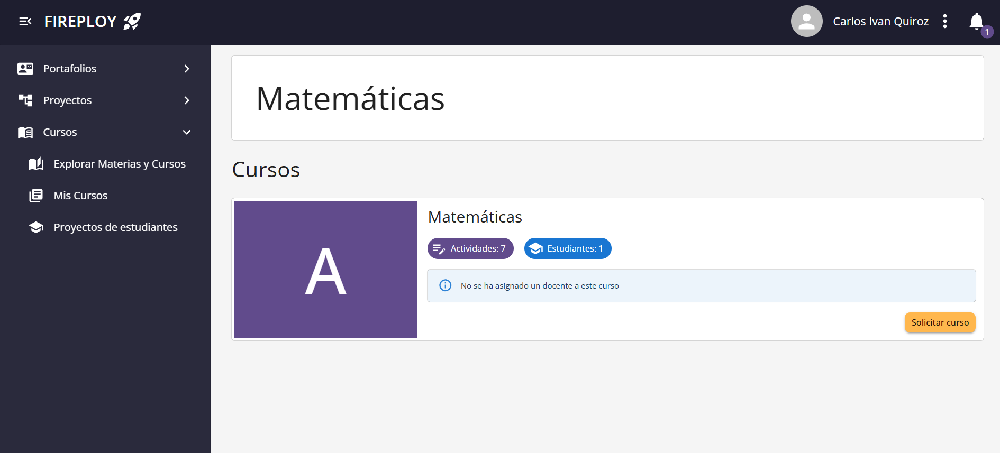
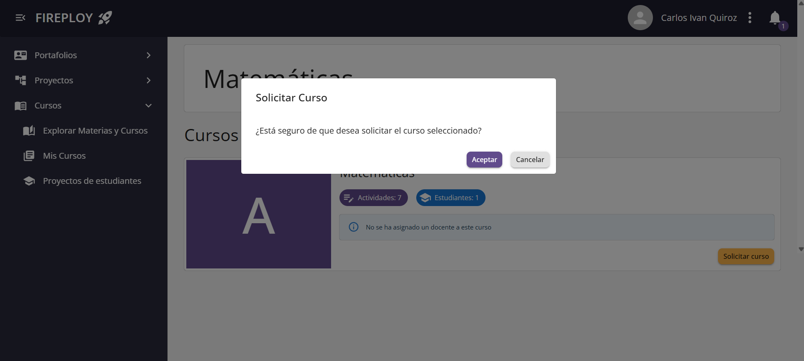
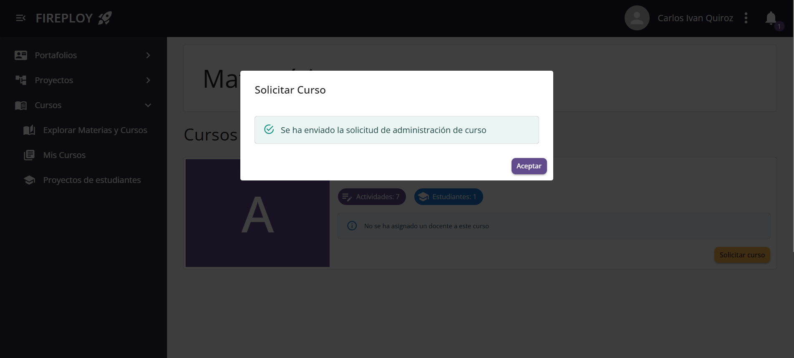
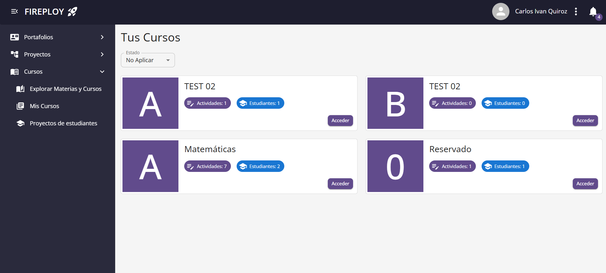
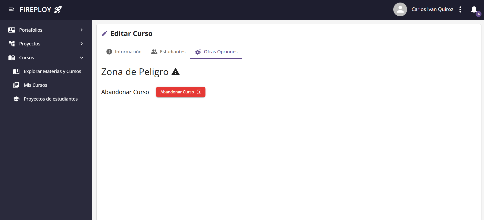
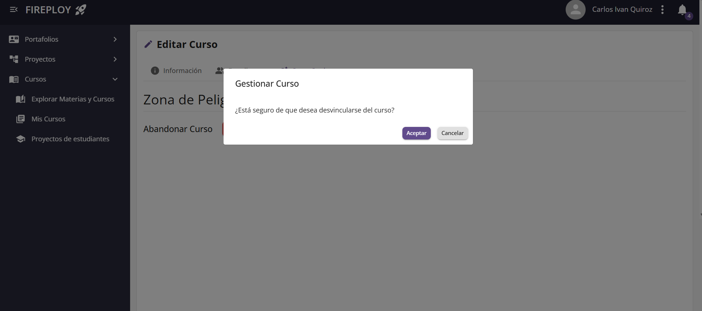
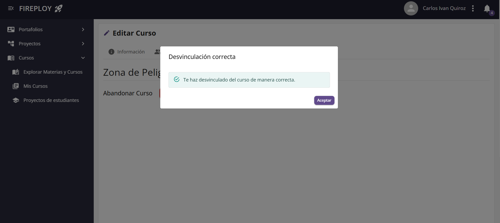
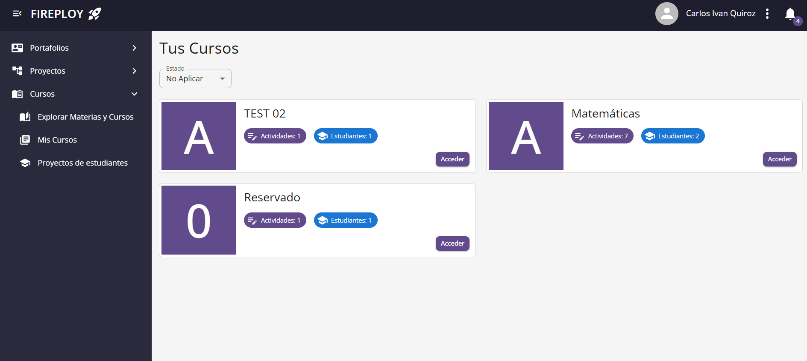

# Vinculación a curso

El rol de **docente** permite a los usuarios solicitar ser docente de un curso directamente desde la plataforma.

Cada curso pertenece a una materia. Un docente puede enviar una solicitud para ser docente de cualquier curso que esté disponible.

:::info
Si el curso ya tiene un docente asignado o si ya existe una solicitud pendiente, la opción de solicitud aparecerá deshabilitada.
:::

## Cómo solicitar ser docente de un curso

1. En el menú de navegación, selecciona la opción **Explorar Cursos**.

2. Elige la materia que deseas consultar.

3. En la lista de cursos, localiza aquel en el que deseas participar como docente.

4. Si el curso está disponible, aparecerá un botón **Solicitar Curso**.
    
5. Haz clic en **Solicitar Curso**.

6. Se abrirá una ventana de confirmación.

7. Haz clic en **Aceptar**.

8. La solicitud será enviada y el estado del curso se actualizará.

---

## Situaciones particulares

| Situación                                        | Visualización en la plataforma                                   |
| ------------------------------------------------ | ---------------------------------------------------------------- |
| El curso no tiene docente                          | Opción **Solicitar Curso** habilitada                            |
| El curso ya tiene un docente asignado            | Botón deshabilitado con mensaje "Curso ya cuenta con un docente" |
| Ya tienes una solicitud pendiente para ese curso | Botón deshabilitado con mensaje "Solicitud pendiente en proceso" |

---

## Retirarse de un curso

1. Ingresa al apartado de **edición de curso**.

2. Verás una sección que dice **Otras Opciones**, en ella está la opción **Abandonar Curso**.
    
3. Haz click en **Abandonar Curso**.

4. Se abrirá una ventana de confirmación.

5. Haz clic en **Aceptar**.

6. Se realizará la desvinculación como **docente del curso**. Serás redireccionado a la vista **Mis Cursos**.

