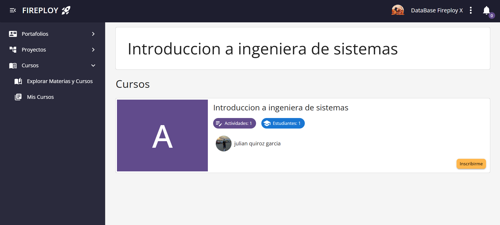
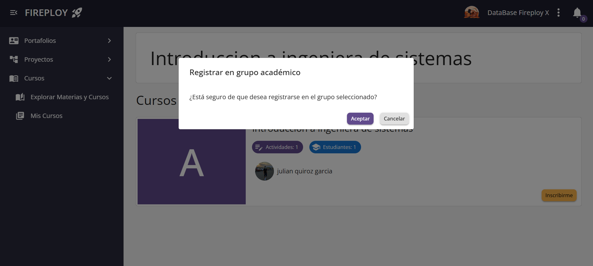
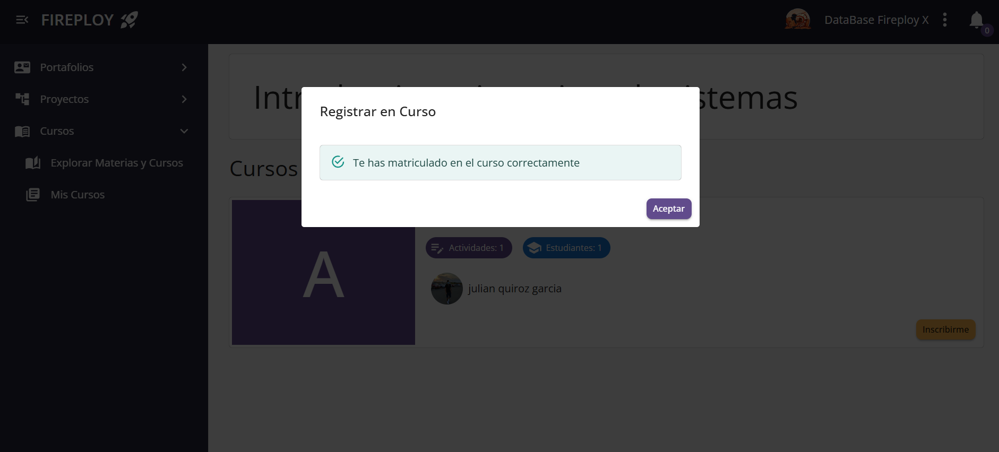
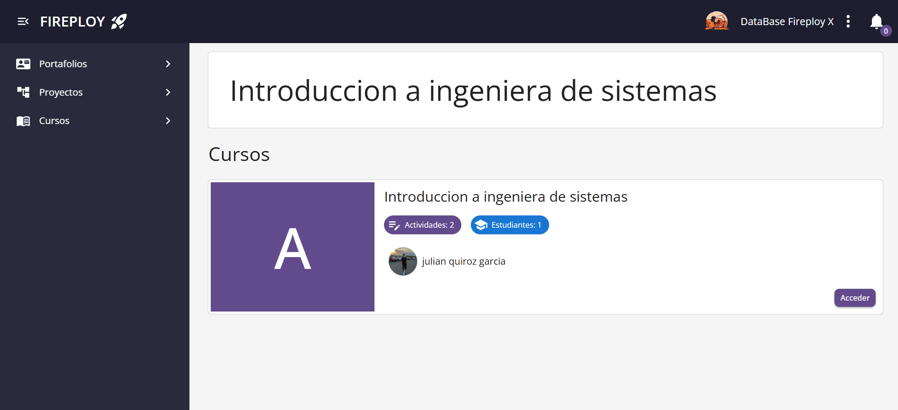
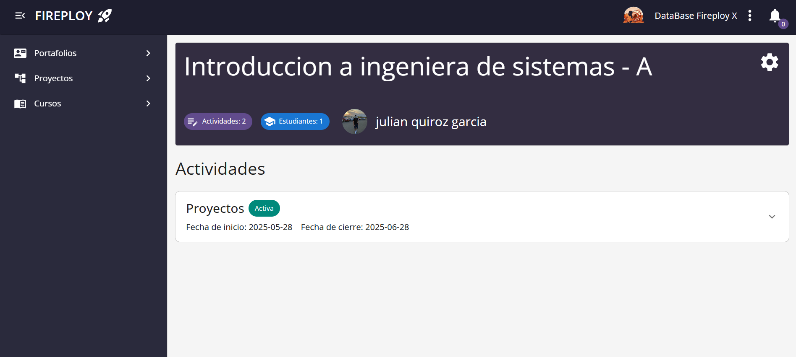
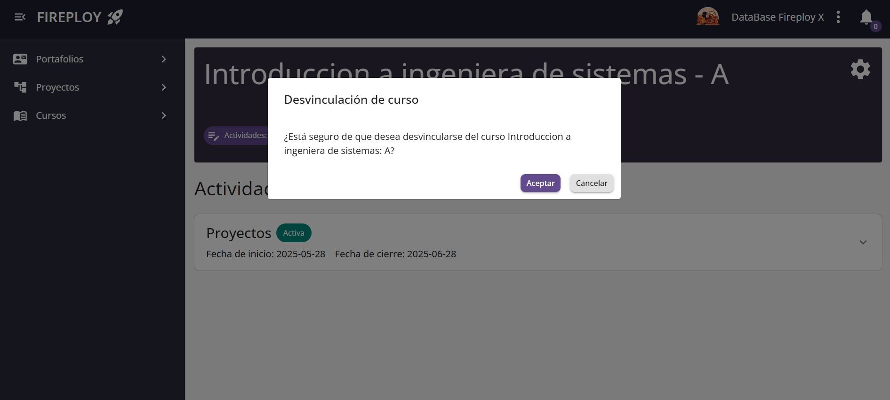
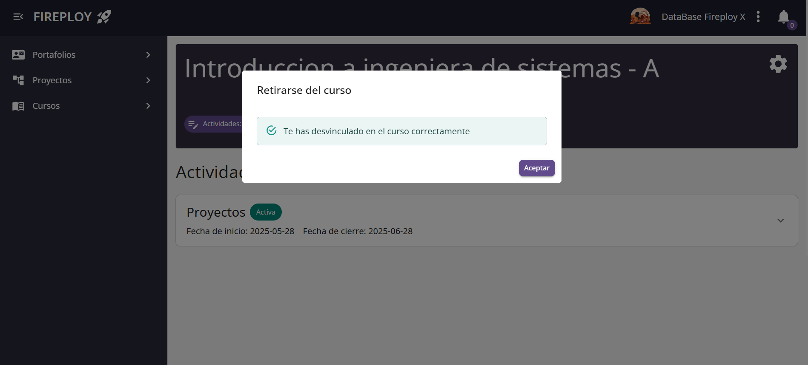

# Inscripción en Cursos

Como estudiante, puedes inscribirte fácilmente en los cursos disponibles dentro de cada materia.  
Este proceso te permitirá acceder al contenido y participar en las actividades de los cursos que te interesen.

A continuación te explicamos cómo funciona el proceso de inscripción paso a paso.

## Proceso de inscripción

Para inscribirte en un curso, simplemente ve a la opción **Explorar Cursos** en el menú de la plataforma.  
Allí podrás ver todas las materias y los cursos disponibles. Sigue previamente los pasos de: [explorar las materias y cursos](../../usuario-general/materias-y-cursos/introduccion/index.md#explorar-las-materias-y-cursos).

Cada curso mostrará si ya estás inscrito o no. Si aún no lo estás, verás el botón **Inscribirse**.

1. Al hacer clic en **Inscribirse**, aparecerá una ventana que te pedirá confirmar que realmente deseas inscribirte.

2. Acepta la realización de inscripción.

✅ ¡Listo! Ya estarás inscrito en el curso y podrás comenzar a participar.

## Desvincularme de un curso

Simplemente dirígete a la vista del curso, presiona el botón de **configuración** y te saldrá la opción de **Desvincularse del curso**.

Acepta y serás retirado del curso.

:::info Reingresar
Puedes volver a ingresar a un curso repitiendo el [proceso de inscripción](./index.md#inscripción-en-cursos)
:::

