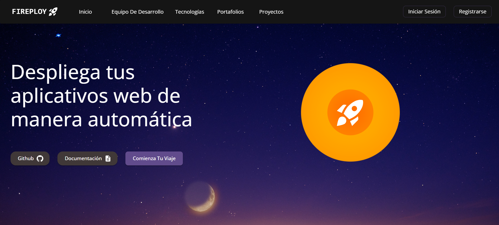
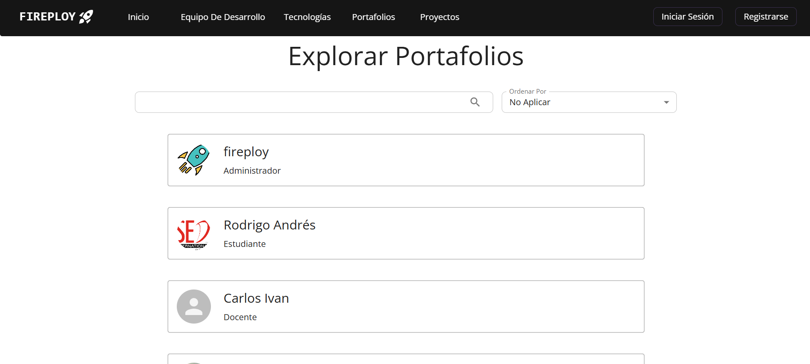
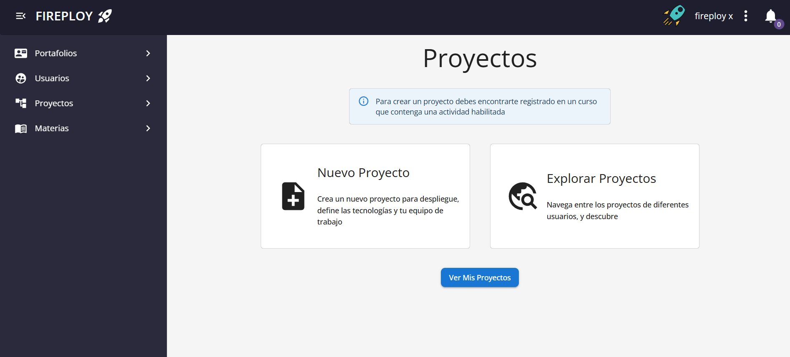
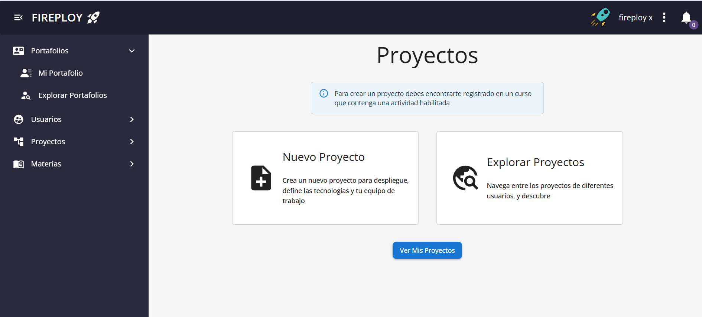
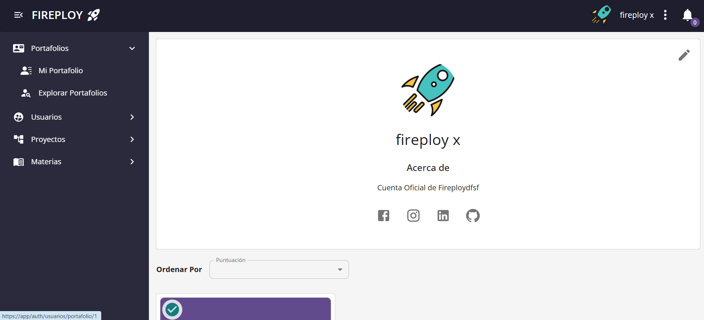
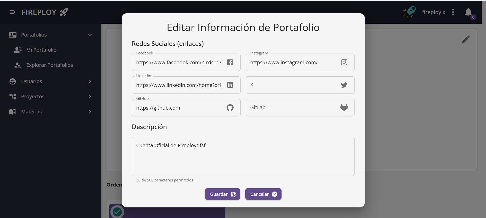
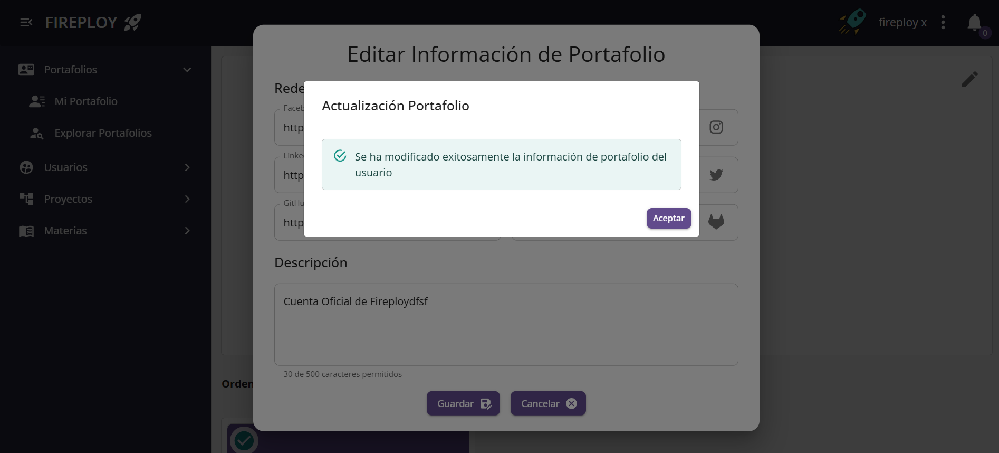

# Visualización y Gestión de Portafolio

Desde Fireploy puedes visualizar y gestionar los portafolios de otros usuarios y el tuyo propio de forma sencilla.

## Visualizar portafolios públicos (sin estar logueado)

1. Ingresa a la página principal de Fireploy.

2. En el menú principal, haz clic en la opción **Portafolios**.

3. Se abrirá una página con los portafolios públicos de los usuarios.  
    Podrás usar el buscador para encontrar portafolios específicos.

4. Escribe el nombre o palabra clave del portafolio que deseas visualizar.

5. Haz clic sobre el portafolio deseado (por ejemplo, **Fireploy**).

6. Se abrirá una página con la información completa del portafolio seleccionado.

## Visualizar portafolios públicos (estando logueado)

1. Inicia sesión en tu cuenta de Fireploy.
2. Desde el menú principal, haz clic en **Explorar portafolios**.

3. Se abrirá una página con los portafolios públicos de los usuarios y un buscador.

4. Utiliza el filtro o la barra de búsqueda para encontrar el portafolio que deseas.
5. Haz clic sobre el portafolio de interés (por ejemplo, **Fireploy**).
6. La información completa del portafolio se mostrará en pantalla.

---

## Visualizar tu portafolio personal

1. Inicia sesión en tu cuenta de Fireploy.
2. Desde el menú principal, haz clic en la opción **Mi portafolio**.

3. Se abrirá una página con toda la información de tu portafolio personal.

---

## Editar la información de tu portafolio

### Editar información básica

1. Dirígete a tu portafolio personal*.
2. Haz clic en la opción **Editar**.

3. Se abrirá un formulario con la información editable del portafolio.

4. Actualiza los campos que desees.

5. Haz clic en **Guardar**.
6. El sistema mostrará un aviso confirmando que los datos fueron actualizados correctamente.

7. Pulsa **Aceptar**.  
    ¡La información de tu portafolio ha sido actualizada!

:::note Notas
    - Si ingresas un enlace a red social inválido, el sistema te mostrará un mensaje de error indicando que el enlace no es válido.
    - Al editar la **descripción** de tu portafolio, ten en cuenta que el campo tiene un límite de **500 caracteres**.
:::

---

## ¿Cómo cancelar los cambios realizados en el portafolio?

1. Si hiciste alguna modificación en tu portafolio y decides no guardar los cambios, haz clic en **Cancelar**.
2. La vista del portafolio se recargará con los datos originales, sin aplicar las modificaciones.

---

Con estos simples pasos puedes visualizar y gestionar tu portafolio en Fireploy de manera fácil y segura 🚀.
