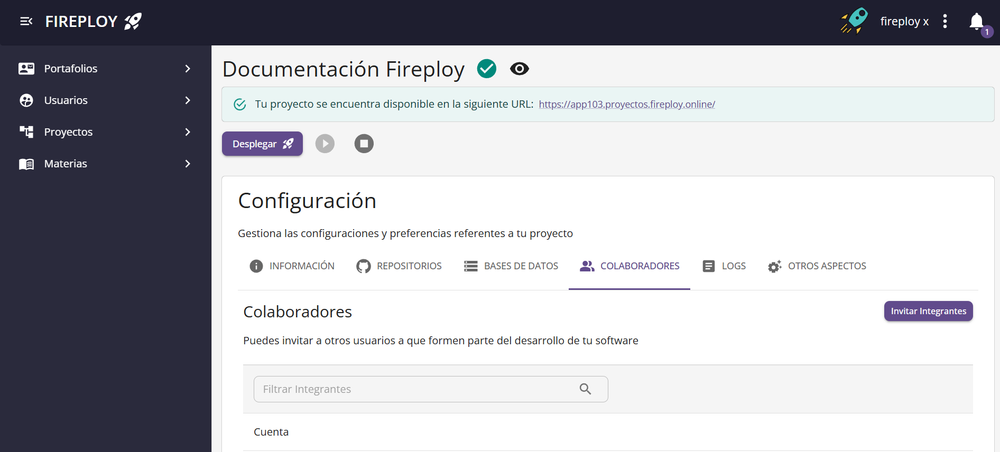
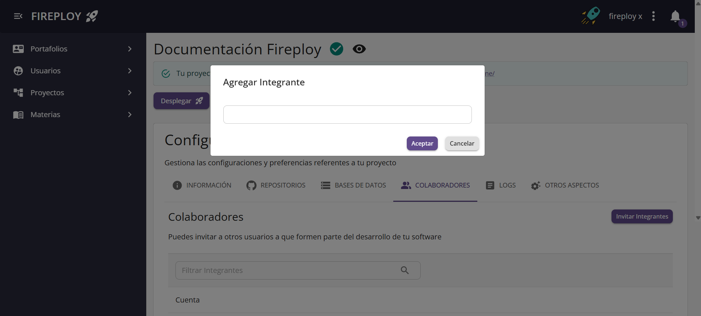
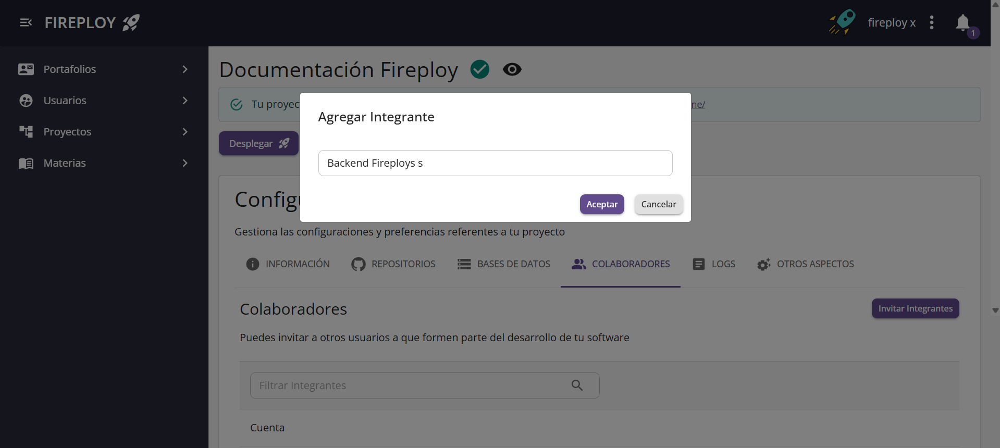
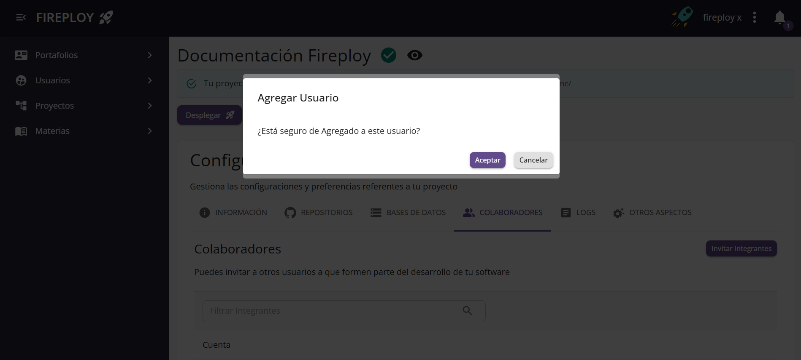
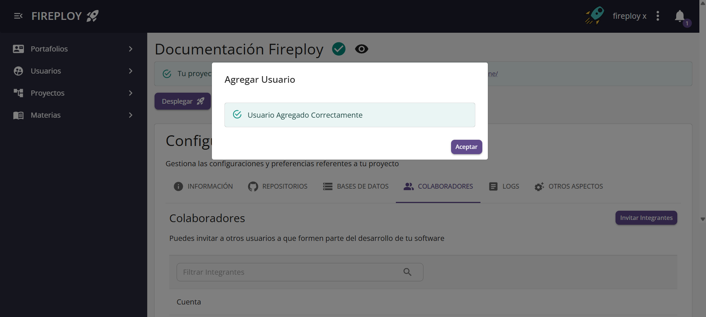
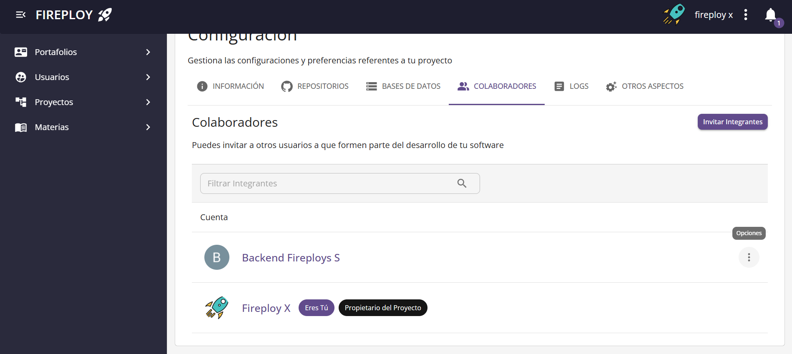
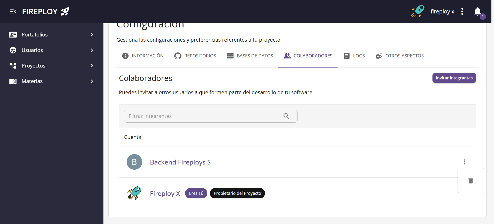
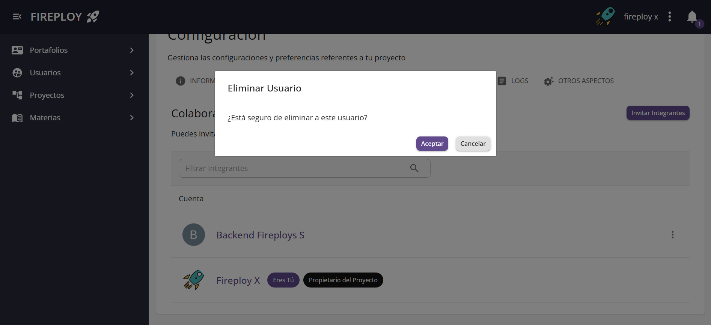
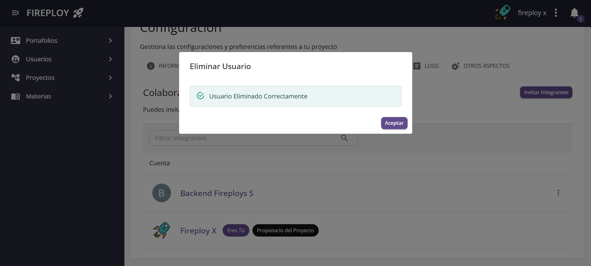
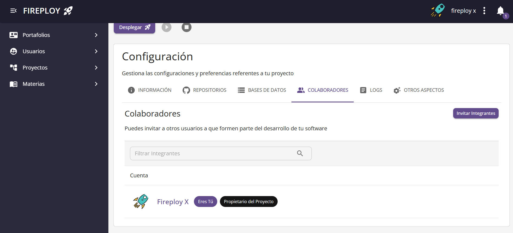

# Gestionar colaboradores del proyecto

Los colaboradores son otros usuarios deo curso que tienen permisos para participar activamente en el proyecto. Son administrable por todos los colaboradores del proyecto, con la peculiaridad de que el creador del proyecto no puede ser eliminado de este.

:::note Notas
- Cualquier colaborador del proyecto puede agregar o eliminar colaboradores.
- Los usuarios invitados recibirán notificación de su incorporación.
- Para que un colaboradores pueda ser agregado se requiere que esté inscrito en el curso que tiene asociado al proyecto.
:::

## Agregar colaboradores

1. En la vista de configuración de tu proyecto, selecciona la pestaña **Colaboradores**.

2. Haz clic en **Invitar colaboradores**.

3. En el buscador que se abre, selecciona el usuario que deseas invitar.

4. Haz clic en **Aceptar** en la página de confirmación.

5. Se mostrará un mensaje indicando que la invitación fue exitosa. 

✅ ¡El colaborador ha sido agregado al proyecto!

---

## Eliminar colaboradores

1. En la vista de configuración de tu proyecto, selecciona la pestaña **Colaboradores**.

2. En la lista de colaboradores, haz clic en el botón **Opciones** del usuario que deseas eliminar.

3. Selecciona la opción **Eliminar**.

4. Haz clic en **Aceptar** en la página de confirmación.

5. Se mostrará un mensaje indicando que la eliminación fue exitosa.

✅ ¡El colaborador ha sido eliminado del proyecto!

