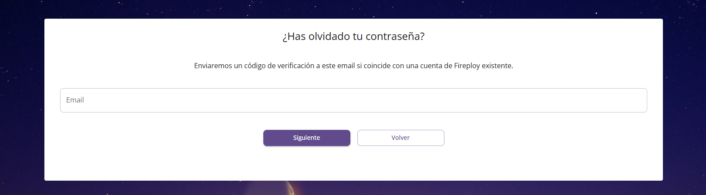
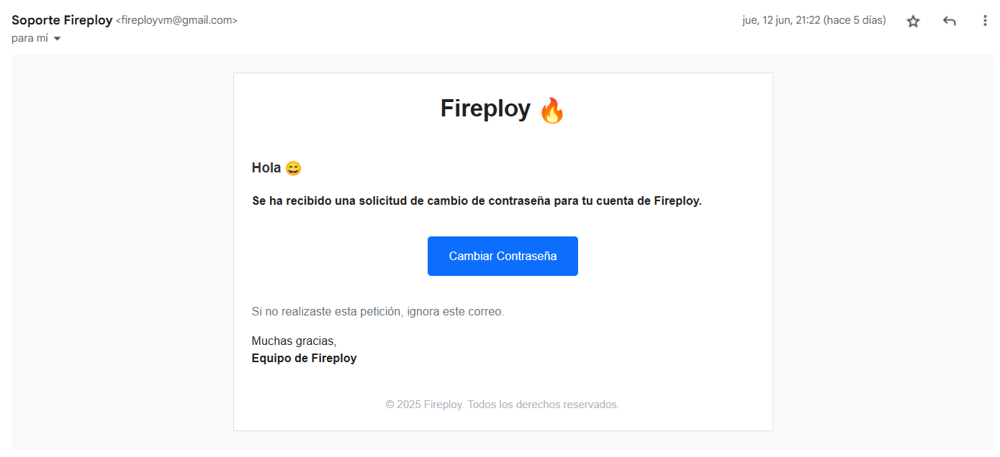
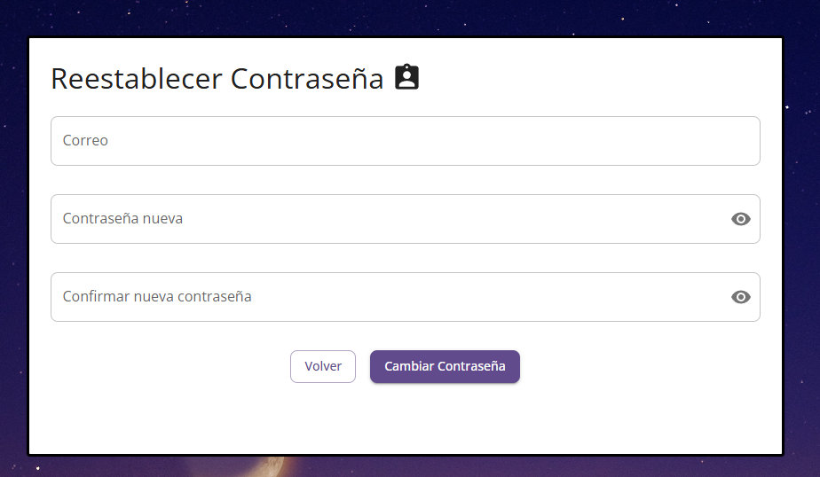

# Recuperación de Contraseña

Si olvidaste tu contraseña, puedes restablecerla fácilmente desde la pantalla de **Inicio de Sesión**.

## ¿Cómo recuperar tu contraseña?

1. En la pantalla de inicio, haz clic en el enlace **“Olvidé mi contraseña”**.

2. Serás redirigido a la página de recuperación de contraseña. Allí, ingresa el correo electrónico que usaste para registrarte en Fireploy.

3. Revisa tu correo electrónico. Recibirás un mensaje con un enlace para restablecer tu contraseña.

4. Haz clic en el enlace que aparece en el correo. Este te llevará a una página donde podrás crear una nueva contraseña.

5. En la página de cambio de contraseña:
    - Escribe tu nueva contraseña.
    - Confirma la contraseña escribiéndola nuevamente.
    - Asegúrate que ambas coincidan y cumplan con los requisitos de seguridad.

6. Haz clic en **Aceptar**. Verás un mensaje de confirmación indicando que tu contraseña ha sido actualizada exitosamente.

7. Finalmente, vuelve a la pantalla de **Inicio de Sesión** y accede con tu nueva contraseña.

---

## Recomendaciones importantes

- **Correo no válido:** si ingresas un correo que no está registrado en el sistema, no recibirás el enlace de recuperación.
- **Contraseñas diferentes:** si las contraseñas no coinciden, el sistema te lo indicará para que puedas corregirlo.
- **Correo diferente:** si en el formulario de cambio de contraseña usas un correo diferente al de tu cuenta, el sistema te mostrará un mensaje de error.

---

Ahora ya puedes recuperar tu acceso a Fireploy en pocos pasos 😄.
