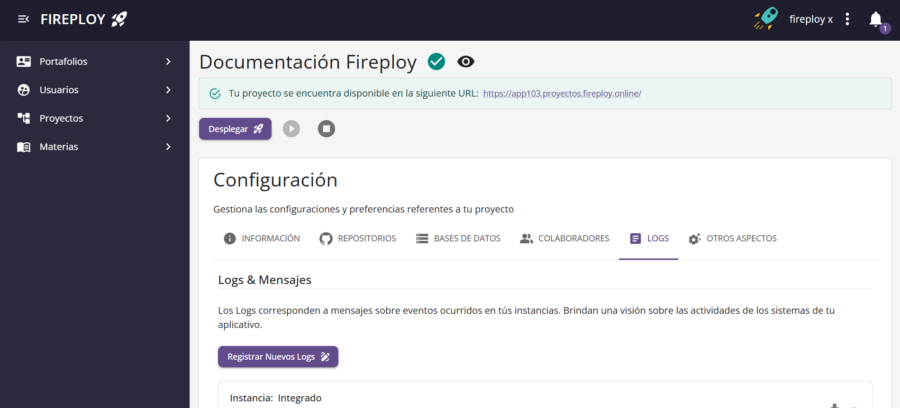
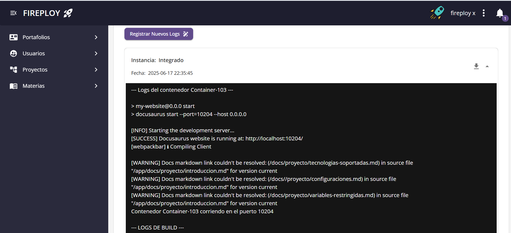
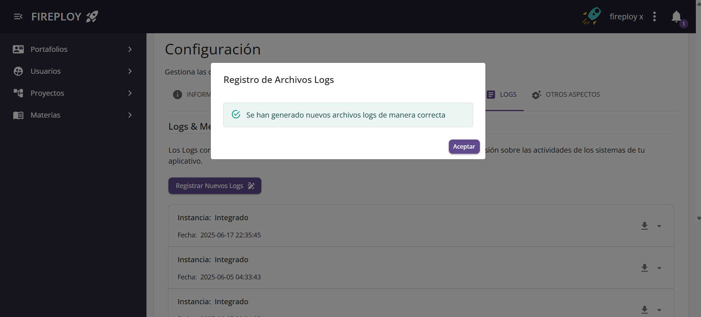

# Gestión de Logs del Proyecto

Los **logs** del proyecto son registros automáticos que documentan eventos relevantes ocurridos durante la ejecución de la aplicación.  
Contienen mensajes informativos, advertencias, errores y otra información útil para el monitoreo y mantenimiento del sistema.

El registro y la visualización de logs permite a los desarrolladores y administradores:

- Analizar el comportamiento de la aplicación
- Detectar y corregir errores
- Validar el estado actual del sistema
- Revisar eventos históricos
- Auditar operaciones realizadas

En Fireploy, puedes tanto **visualizar logs existentes** como **generar nuevos logs** en tiempo real.  
Esto facilita el seguimiento de la salud de los proyectos y asegura que los procesos estén funcionando de manera adecuada.

:::note Notas
- Los logs pueden variar según el estado actual del proyecto y la actividad reciente.
- Generar nuevos logs puede tomar unos segundos, dependiendo de la complejidad del proyecto.
- El historial de logs se mantiene disponible para futuras consultas.
- Siempre que se cambie el estado de un proyecto se generan nuevos logs en capa.
:::

---

## Visualizar logs

1. En la vista de configuración de tu proyecto, selecciona la pestaña **Logs**.

2. Selecciona el log que deseas visualizar.

:::note Nota
    Se cuenta de igual manera con la opción de descargar el log dando click en el respectivo icono.
:::

---

## Generar nuevos logs

1. En la vista de configuración de tu proyecto, selecciona la pestaña **Logs**.

2. Haz clic en la opción **Registrar nuevos logs**.

3. Se mostrará una página de espera mientras se generan los logs, una vez generados se muestra el siguiente mensaje:

✅ ¡Has generado y visualizado correctamente los nuevos logs!

