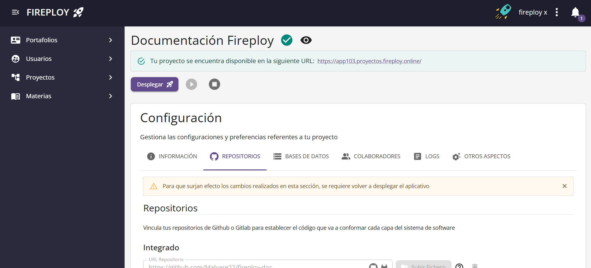
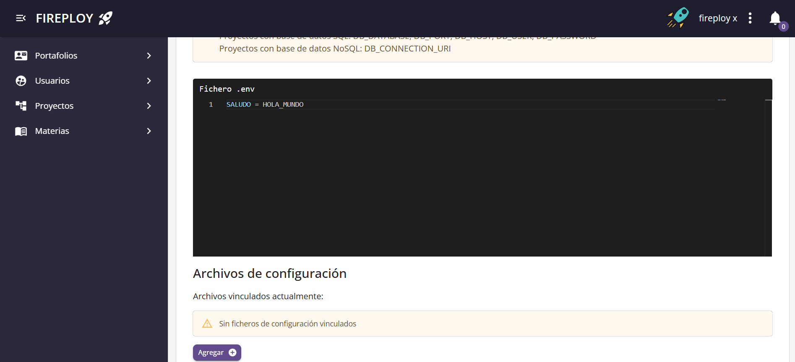
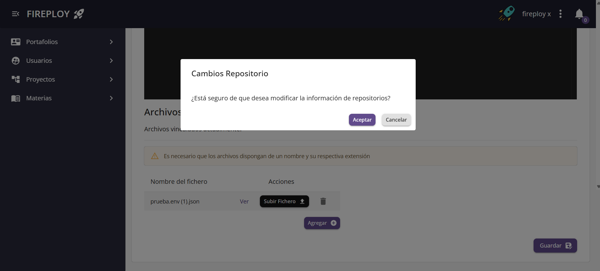
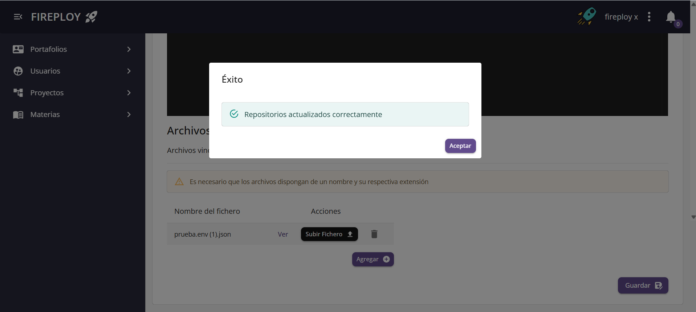
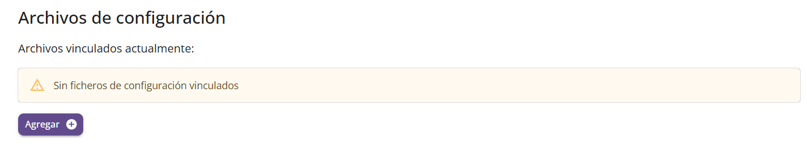
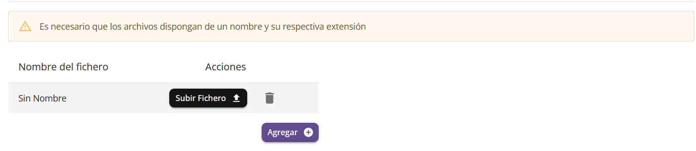
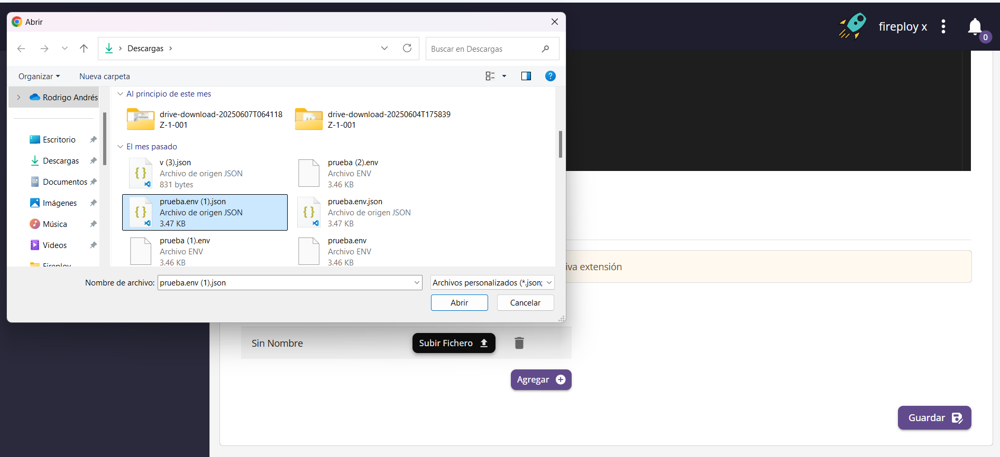

# Variables de Entorno y archivos de configuración

:::note Importante
  Las variables de entorno y archivos de configuración se manejan de manera **individual** por capa del aplicativo.
:::

## Variables de entorno

Las variables de entorno son pares de nombre/valor que se almacenan en el sistema operativo y que afectan el comportamiento de los procesos en ejecución. Sirven para configurar aspectos de una aplicación sin modificar su código fuente. Dicho de otro modo, son valores externos que una aplicación puede leer para adaptarse a diferentes entornos (desarrollo, pruebas, producción).

:::info Importancia de las variables de entorno
Permiten manejar información sensible (como contraseñas, claves de API o tokens de autenticación) fuera del código fuente, evitando que estos datos queden expuestos en los repositorios o en el propio código.
:::

### Ejemplo de archivo .env

Supongamos que tienes una aplicación web que se conecta a una base de datos.

En tu computador local, la base de datos está en: localhost.

En el servidor de producción, la base de datos está en: db.produccion.com.

Si pones la dirección de la base de datos "escrita a mano" en el código, tendrías que cambiar el código cada vez que despliegues.
Con variables de entorno, puedes hacer que tu aplicación lea el valor de una variable como:

```bash title='.env'
    DATABASE_URL=localhost
```

En producción, simplemente cambiarías la variable:

```bash title='.env'
    DATABASE_URL=db.produccion.com
```
### Modificar Variables de Entorno

1. En la vista de configuración de un proyecto selecciona la pestaña **Repositorio**.

2. Ingresa las variables.

3. Haz clic en **Guardar**.

4. Pulsa **Aceptar** en el cuadro de confirmación.










## Archivos de configuración

Además de las variables de entorno definidas en archivos `.env`, muchas plataformas y servicios generan sus propios **archivos de configuración**, que contienen datos necesarios para que la aplicación se conecte y funcione correctamente con esos servicios externos.

Un ejemplo común es el archivo de configuración de **Firebase**, que normalmente es un archivo en formato **JSON** que incluye:

- Claves públicas de acceso al servicio
- Identificadores del proyecto
- URLs de APIs de Firebase
- Configuración específica para servicios como autenticación, Firestore, Storage, etc.

---

### Ejemplo de archivo (JSON de Firebase)

```json title='firebase-config.json'
{
  "apiKey": "AIzaSyA...vEjM",
  "authDomain": "mi-proyecto.firebaseapp.com",
  "projectId": "mi-proyecto",
  "storageBucket": "mi-proyecto.appspot.com",
  "messagingSenderId": "123456789",
  "appId": "1:123456789:web:abcdefg123456"
}
```

### Modificar Ficheros

1. En la vista de configuración de un proyecto selecciona la pestaña **Repositorio**.

2. Haz clic en **Cargar archivo (.json)**.

3. Selecciona un archivo válido desde tu dispositivo.

4. Haz clic en **Guardar**.

5. Pulsa **Aceptar** en el cuadro de confirmación.






