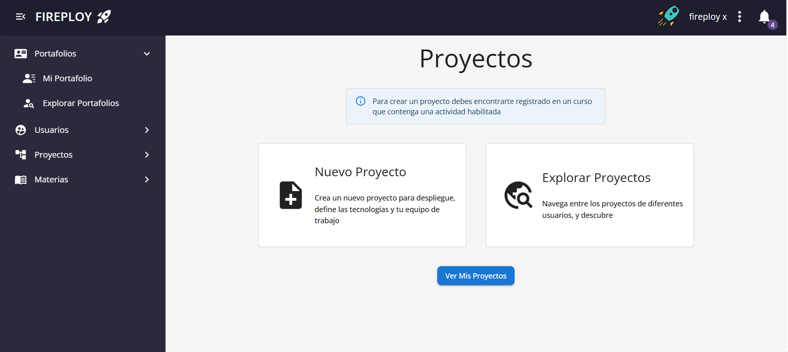
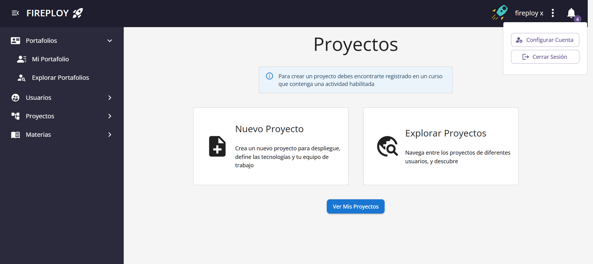

# Cerrar sesión

1. Una vez autenticado, en la parte superior derecha de la plataforma se muestra el **icono de perfil (avatar)**.

2. Pulsa sobre el icono de **tres puntos** para acceder a opciones adicionales.

3. Pulsa sobre **Cerrar sesión**.

4. El sistema cerrará la sesión y redirigirá a la página de inicio de sesión.

