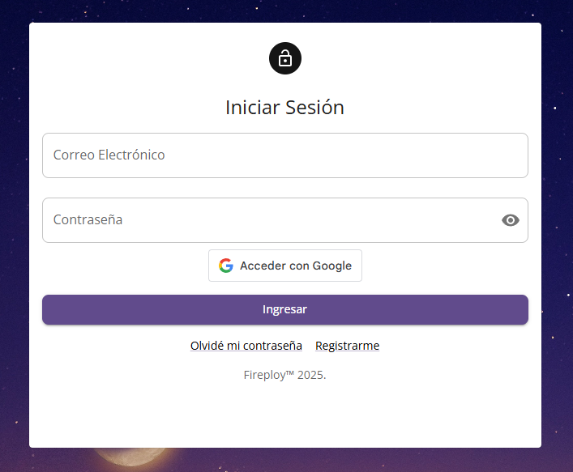

# Inicio de Sesión

Se permite el inicio de sesión a la plataforma, ya sea mediante un formulario de registro propio o usando el servicio de autenticación de Google Account. Debemos acceder a la vista **Iniciar sesión**.

Aquí se presenta un formulario que cuenta con las siguientes opciones:

## Formas de iniciar sesión

### 1. Inicio de sesión con usuario y contraseña

Ingresamos la información del formulario, que consta de los siguientes elementos.

- Correo electrónico.
- Contraseña.

### 2. Inicio de sesión con Google Account

Simplemente presiona la opción **Acceder con Google**, se solicitará seleccionar una cuenta y listo.

:::info[Nota]

En el caso de ingresar con Google Account y no encontrarse registrado en el sistema, el usuario se va a crear de manera automática. Para más información sobre el [proceso de registro con Google Account](../registro/index.md#b-registro-mediante-google-account).

:::

