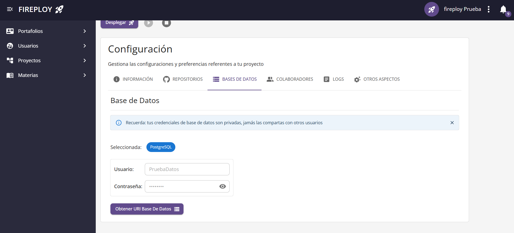

# Bases de datos

Las bases de datos son componentes clave que permiten almacenar, organizar, y gestionar la información que usa la aplicación. Es indispensable que la base de datos se encuentre configurada en la capa del backend, se entra en detalle en este aspecto en el apartado [configuraciones previas](../../proceso-de-despliegue/configuraciones-previas/index.md#configuración-de-bases-de-datos).
            

## Tecnologías de base de datos soportadas

Fireploy soporta los siguientes motores de bases de datos:

- MySQL
- PostresSQL
- MariaDB
- MongoBD

### Ilustración

## Definir base de datos en el aplicativo

Al momento de crearse el proyecto, puede omitirse el uso de la base de datos de Fireploy. Posteriormente puede accederse al servicio de base de datos mediante el apartado **Base de Datos** de **Configuración de proyecto**. Crea las credenciales de base de datos, con ellas puedes acceder remotamente.

:::note Nota

    Para acceder a la base de datos simplemente ingresa con la información de la URI en un cliente de base de datos que permita acceso remoto.

:::

