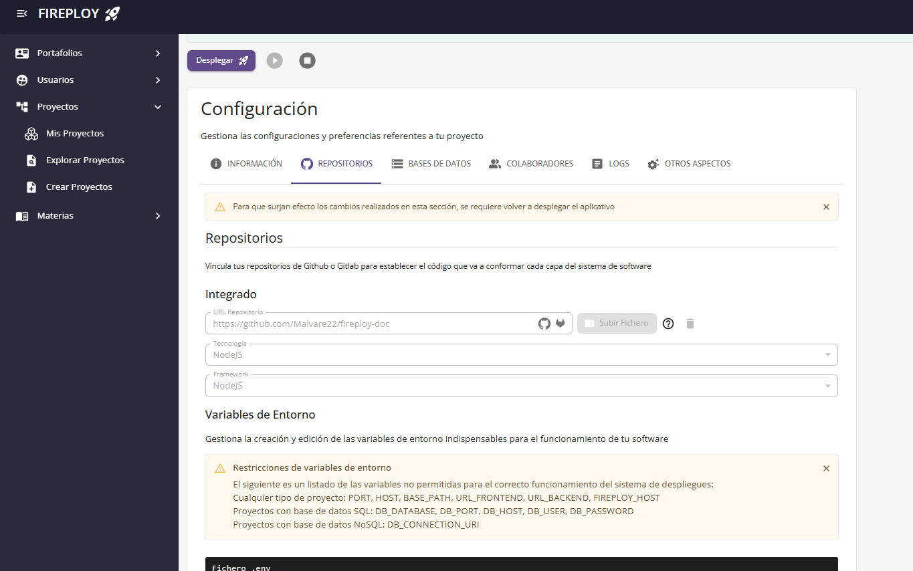

# Repositorios y código fuente

Un **repositorio** es el lugar donde se almacena el código fuente de un proyecto (y en muchos casos también su documentación, scripts, archivos de configuración, etc.). Generalmente se usa un sistema de control de versiones (como Git), que permite guardar un historial de los cambios, colaborar con otros desarrolladores y mantener distintas versiones del software (por ejemplo, versión en desarrollo, en pruebas, en producción). Un ejemplo de repositorio sería un proyecto alojado en plataformas como **GitHub** o **GitLab**.

Fireploy sustrae el código fuente de dos maneras:
-  Mediante la vinculación directa del código fuente en un formato .zip o .rar.
-  Mediante la vinculación del repositorio donde se almacena el código fuente.

Los repositorios guardan una relación con las capas para Fireploy, ya que permiten la diferenciación de los elementos de un aplicativo (las capas) y dan accesibilidad a su información (el código). A su vez cada repositorio se encuentra asociado a una de las tecnologías o librerías soportadas por Fireploy. Para más información sobre esto visita: [Tecnologías Soportadas y Tipo de proyecto](../../capas-y-tecnologias/index.md#tecnologías-soportadas).