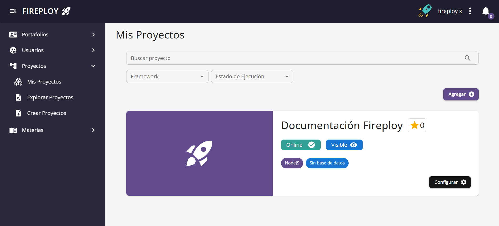
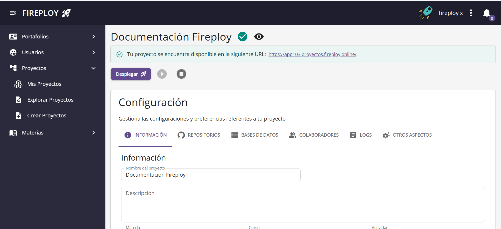
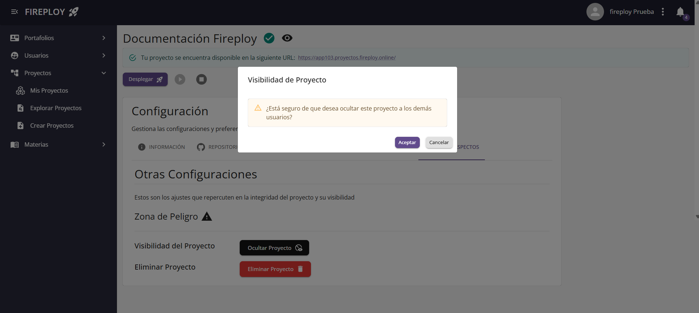
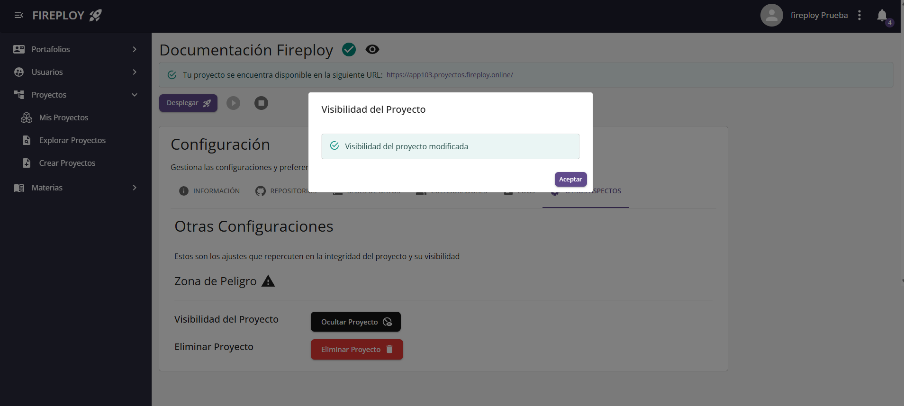
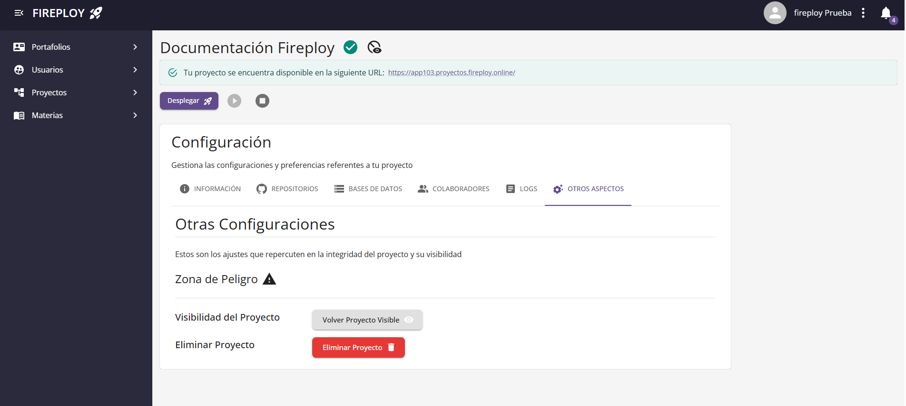
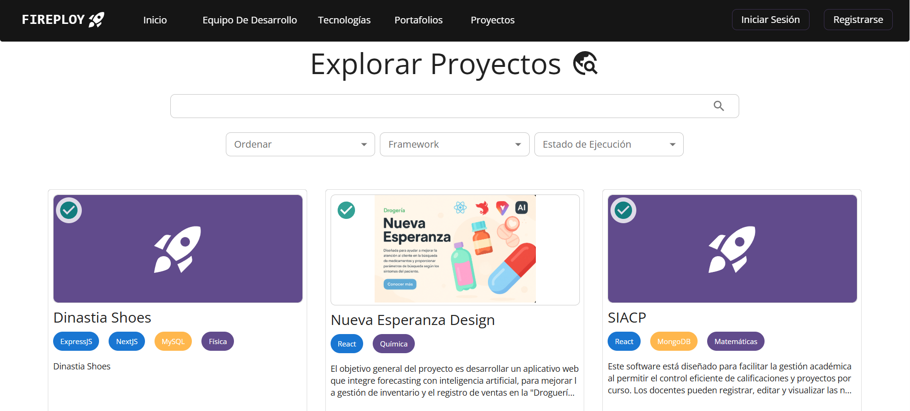
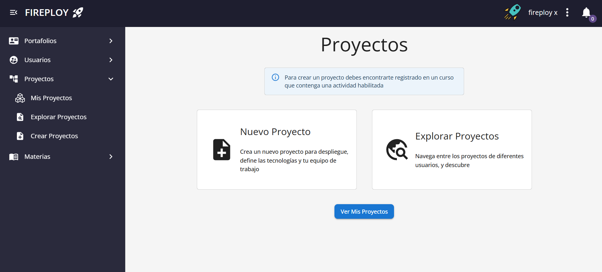
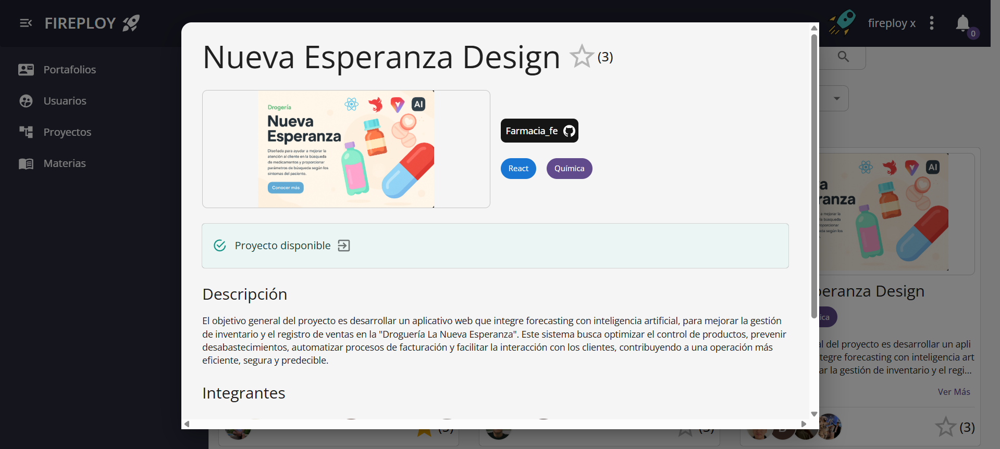

# Visualizar proyectos

---

## Visualizar mis proyectos

1. Dirígete a la opción **Mis Proyectos**.

2. Localiza el proyecto que deseas consultar.

3. Haz clic en **Ver más** para ver las configuraciones de tu proyecto.

## Modificar visibilidad de mis proyectos

Si deseas que tus proyectos no sean visibles por los otros usuarios puedes seguir el siguiente proceso.

1. Dirígete al apartado **Otros** de la configuración de tu proyecto.

2. Presiona en **Ocultar Proyecto** y acepta.

3. Tu proyecto ha sido ocultado correctamente.

Para revertir el proceso simplemente vuelve a realizarlo, observarás que el botón de ocultar a cambiado a **Volver Proyecto Visible**.

## Visualizar proyectos de otros usuarios

### Acceso a Proyectos Públicos

Puedes consultar proyectos públicos desde el menú principal de Fireploy sin necesidad de estar logueado, siguiendo estos pasos:

1. Ingresa a la página de inicio de Fireploy.

2. Haz clic en la opción **Proyectos** del menú principal.

3. Se abrirá la vista de proyectos públicos con opciones de búsqueda y filtros.

### Acceso autorizado

Simplemente dirígete a la opción **Explorar proyectos**

---

### Ver detalle de un proyecto

1. Localiza el proyecto que deseas consultar.
2. Haz clic en **Ver más**.

Se abrirá la página del proyecto con su descripción, tecnologías usadas, estado, puntuación y enlace de despliegue (si está online).

---

¡Compartes tus proyectos con éxito en Fireploy! 🎉

