## Buscar un curso

### 1. Ingresa a la vista `Explorar Materias`

### 2. Escoge la materia correspondiente a tu curso

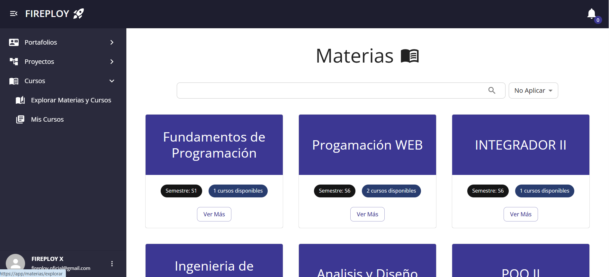

### 3. Selecciona el curso

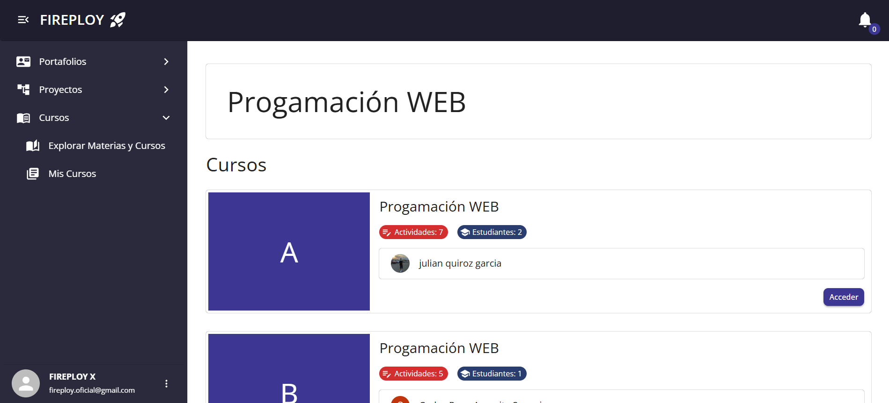

## Registrarse en un curso

Aquellos cursos en los que no se encuentre registrado, tendrán la opción de "Inscribirme". Al oprimirla saldrá una ventana de confirmación. Una vez aceptada, se realizará el registro de manera automática.

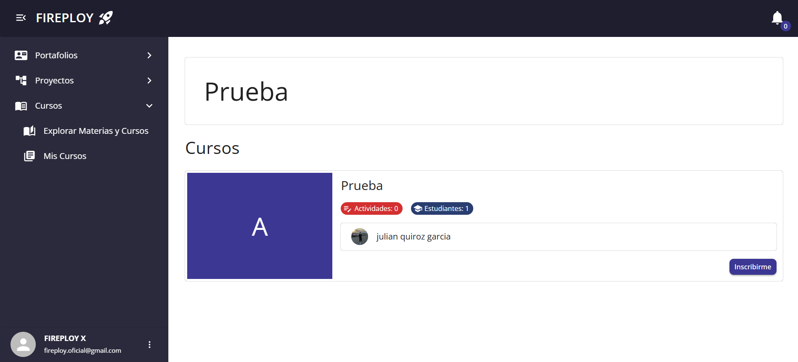

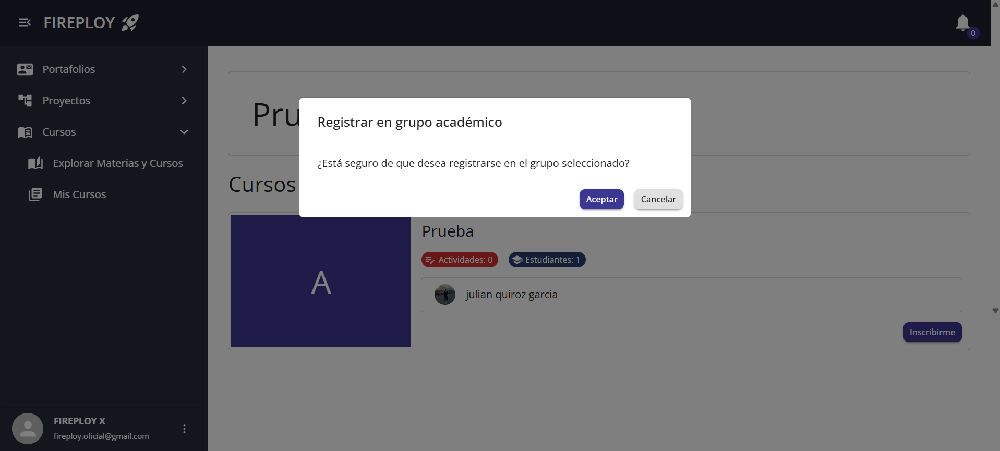

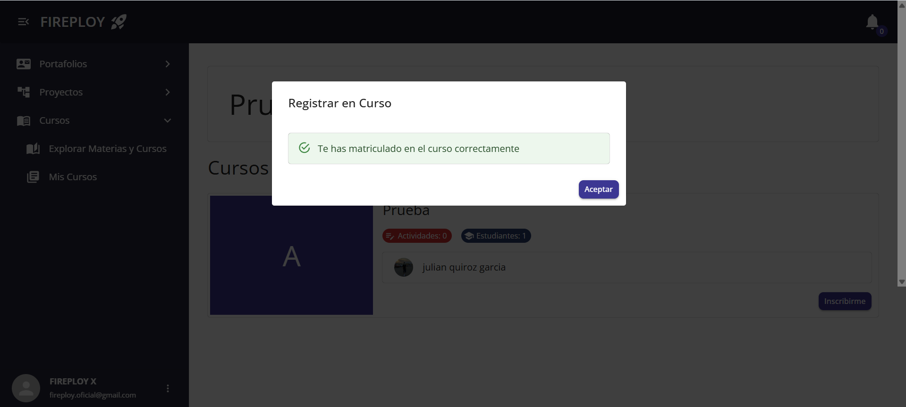

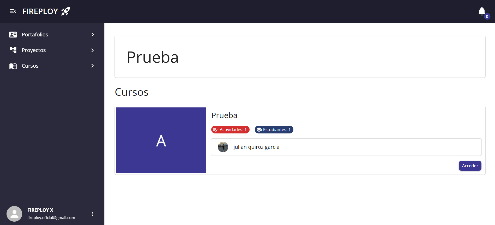

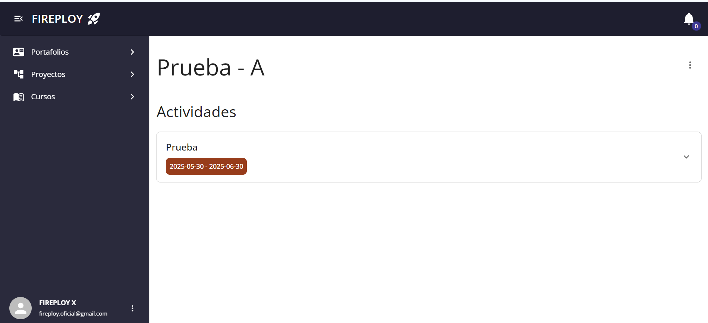

Ahora el curso se podrá acceder desde el apartado de `Mis Cursos`.

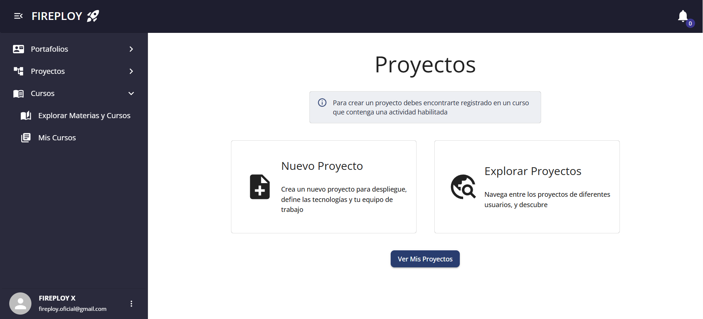

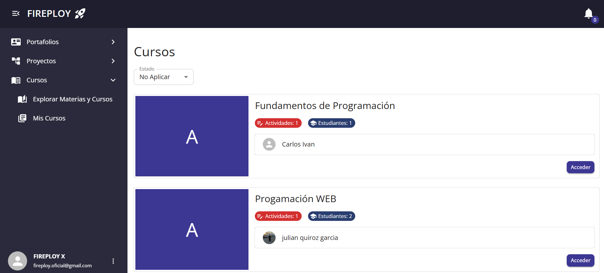

## Desvincularse de un curso

Dentro de la vista del contenido del curso, hay un menú desplegable dentro del cual está la opción de "Retirarse de un curso". Al oprimirlo saldrá una ventana de confirmación. Oprime "Aceptar" para desvincularte del curso.

:::info Volver a ingresar al curso

Una vez desvinculado de un curso, es posible volver a registrarse en este con completa normalidad.

:::

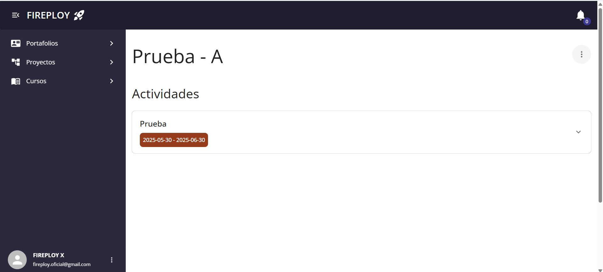

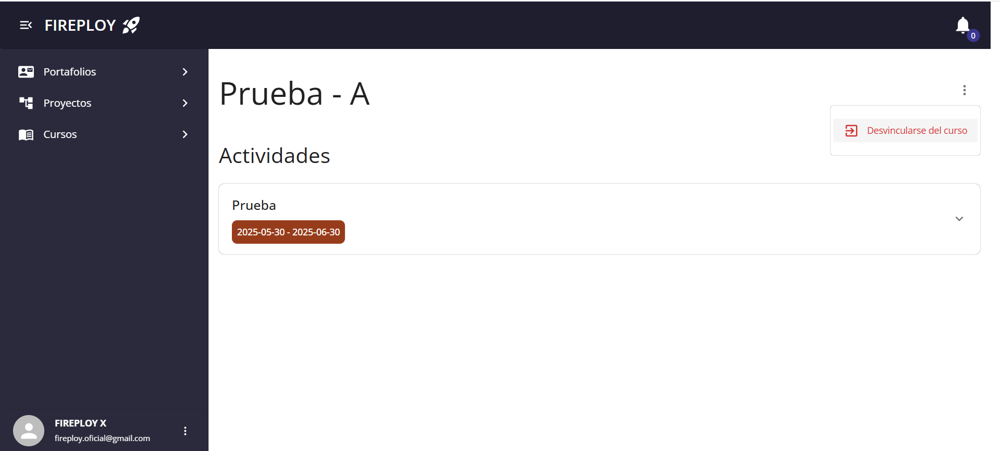

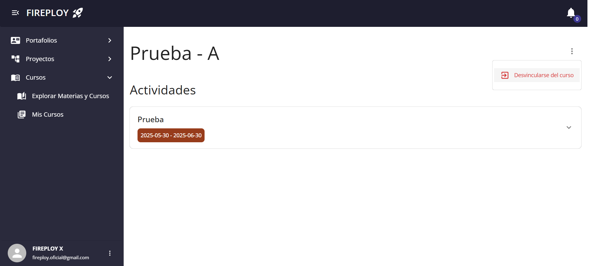

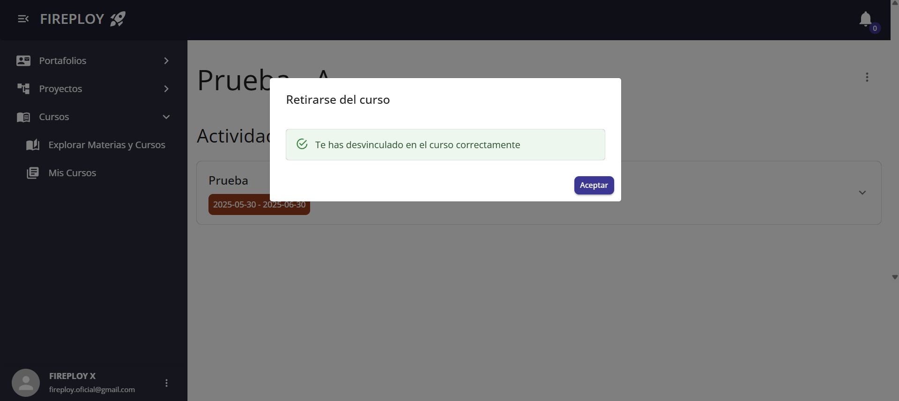

