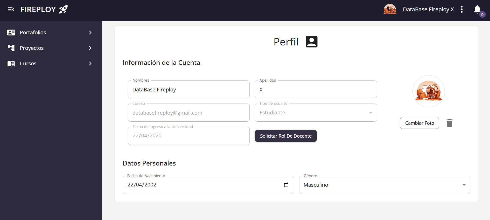
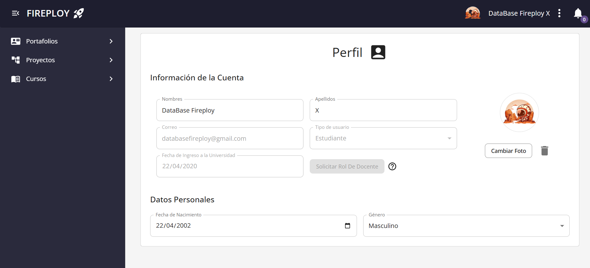

# Solicitar Rol Docente

Primeramente debes solicitar el cambio de rol a **docente** en la plataforma de manera sencilla.  
Este proceso te permitirá acceder a funcionalidades avanzadas para la gestión de cursos.

---

## Solicitar el rol de docente

Sigue estos pasos:

1. Ve a tu **Perfil**, para más información visita: [visualizar perfil](../../usuario-general/informacion-de-usuario/perfil/index.md).

2. Confirmación de solicitud

- Al pulsar el botón **Solicitar Rol de Docente**, verás una ventana de confirmación.
- Si estás seguro, haz clic en **Aceptar**.
- El sistema procesará la solicitud y te mostrará un mensaje confirmando que la solicitud fue enviada correctamente.

Después de enviar tu solicitud:

- El botón quedará deshabilitado.
- No podrás enviar otra solicitud mientras la actual esté pendiente.

---

## Si ya tienes una solicitud pendiente

Si ya enviaste una solicitud y aún no ha sido respondida:

- El botón **Solicitar Rol Docente** estará desactivado.
- Aparecerá un mensaje indicándote que ya tienes una solicitud en curso.

---

## ¿Qué pasa después de enviar la solicitud?

Tu solicitud será revisada por un administrador. El proceso es el siguiente:

| Estado de la solicitud | ¿Qué significa?                                                                      |
| ---------------------- | ------------------------------------------------------------------------------------ |
| **Pendiente**          | El administrador está revisando tu solicitud.                                        |
| **Aprobada**           | ¡Felicidades! Ahora eres **docente** en la plataforma.                               |
| **Rechazada**          | Tu solicitud no fue aprobada. Si lo deseas, podrás volver a intentarlo más adelante.  |

---

:::note Notas

- Solo puedes tener **una solicitud activa** a la vez.
- No es posible cancelar la solicitud una vez enviada.
- Te notificaremos cuando tu solicitud haya sido aprobada o rechazada.

:::
