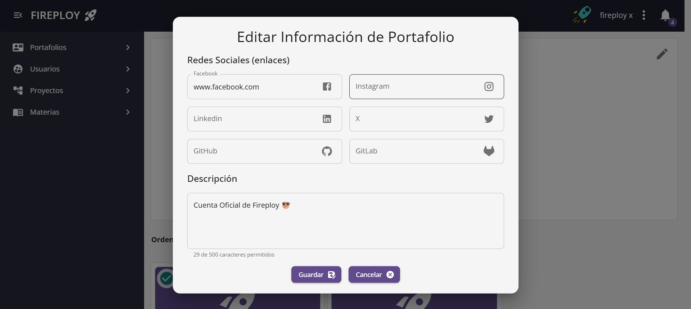
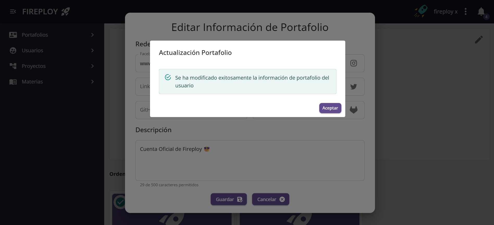
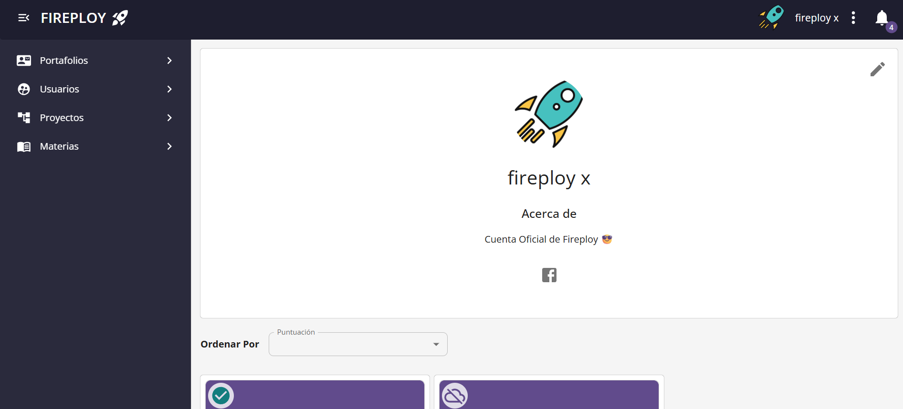

# Edición de portafolio propio

Para actualizar o personalizar tu portafolio:

1. En el menú principal selecciona **Mi portafolio**.

2. Pulsa el botón **Editar**.

3. Se abrirá un formulario para actualizar:

- Redes sociales (GitHub, GitLab, LinkedIn, etc.)
- Descripción personal (máximo 500 caracteres)

4. Realiza los cambios deseados (por ejemplo: cambiar la descripción a *Mi portafolio de proyectos*).

5. Pulsa **Guardar**.

6. La plataforma mostrará una notificación de actualización exitosa.

