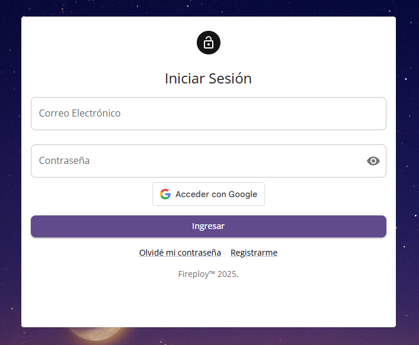

# Inicio de Sesión

Se permite el inicio de sesión a la plataforma, ya sea mediante un formulario de registro propio o usando el servicio de autenticación de Google Account. Debemos acceder a la vista `Iniciar sesión`.

Aquí se presenta un formulario que cuenta con las siguientes opciones:

## 1. Inicio de sesión con usuario y contraseña

Ingresamos la información del formulario, que consta de los siguientes elementos.

| Campo                      | Descripción                          |
|----------------------------|--------------------------------------|
| Correo electrónico         | Formato válido de email, requerido    |
| Contraseña                 | Mínimo 8 caracteres, con seguridad    |
| Iniciar sesión con Google  | Opción de autenticación con Google    |

## 2. Inicio de sesión con Google Account

:::warning[Advertencia]

En el caso de ingresar con Google y no encontrarse registrado en el sistema, se crea una cuenta de manera automática, para más información visita: XX_YY

:::

Una vez ingresados se cargará la vista menú del Modulo de Proyectos.

