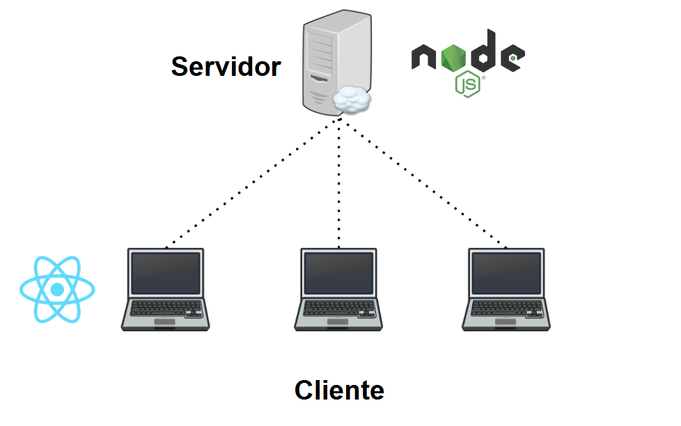
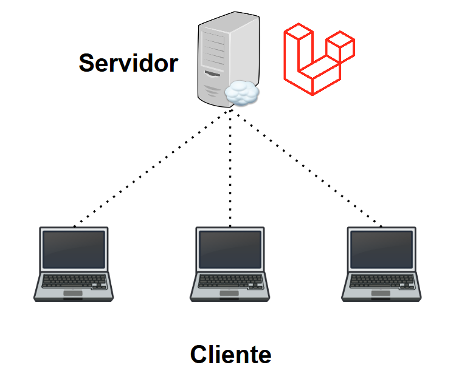
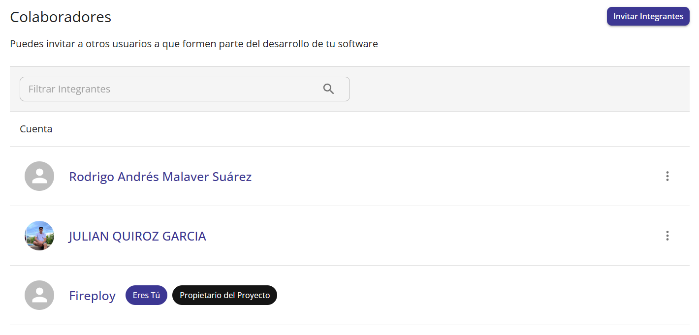

# Introducción

Los proyectos son la piedra angular de Fireploy, son conformados por metadatos y los repositorios con sus correspondientes configuraciones. La información administrable de un proyecto ha sido dividida en las siguientes secciones:

### Información General

| Nombre del proyecto                                | Descripción | Materia | Curso | Actividad |
| -------------------------------------------------- | ----------- | ------- |-------|-----------|
| Un texto con una longitud máxima de 50 caracteres  | Un texto con una longitud máxima de 512 caracteres   | La materia donde se encuentra el grupo al que se va a vincular el proyecto    | El curso donde se encuentra activa la actividad a la que se va a vincular | La actividad a vincular |

A su vez existe un campo `Tipo de Proyecto`.

### Tipo de proyecto

Los tipos de proyecto permitidos en Fireploy se catalogan cómo "Dos Capas" o "Software Completo". Definiéndose el primero como aquellos que presenten dos repositorios (uno enfocado al Frontend y otro al Backend).

Por otra parte es "Software Completo", aquel que maneje el concepto de monolito, es decir, tanto su lógica de vistas como backend se encuentren definidos en la misma capa. Un buen ejemplo de esto es un software que maneje estos dos aspectos con **Laravel**:

Si se quiere ser más minucioso en dichas definiciones, estas no se rigen por completo en los conceptos básicos de arquitectura de software, ya que no se contempla la capa de datos. La configuración de esto se aprecia con detalle en el apartado [bases de datos](/docs/proyecto/bases-de-datos)

#### Información de Repositorio

Fireploy soporta el despliegue en varias tecnologías y frameworks. Esta información se detalla en el apartado de `Tecnologías disponibles`. Teniendo esto en cuenta, deben asignarse a un proyecto uno o dos repositorios (depende del campo tipo de proyecto de la sección #información general), para cada repositorio se gestiona:

#### Código del proyecto

El sistema requiere clonar los datos de un repositorio, para ello se debe ingresar la dirección URL respectiva. No obstante, se tiene la posibilidad de cargar directamente un archivo ".zip" con la información del respectivo repositorio del proyecto, en este caso Fireploy realizará el montaje de un repositorio en la plataforma de GitHub, para el montaje de los datos del archivo ingresado.

:::danger[Peligro]

Los archivos ".zip", deben constar de la raíz del proyecto sin carpetas intermedias.

:::

#### Colaboradores de un proyecto

La configuración de un proyecto puede ser modificada por una lista usuarios que el dueño del proyecto gestione. Más información en el apartado `Colaboradores`.

#### Archivos LOGS

Son los archivos de registro, información obtenida de las consolas de ejecución de las capas del proyecto al momento de una `gestión de estado de un proyecto`. Más información en `Archivos Logs`.

    

