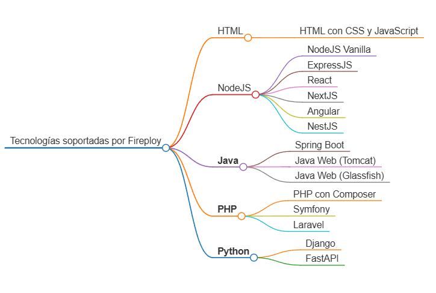

# Frameworks

Fireploy posee un número limitado de frameworks disponibles para despliegue automático, existen algunas que requieren una sintaxis especial para sus variables de entorno, así como otras difieren en su complejidad de configuración. Todos los frameworks y tecnologías requieren especificar el puerto de ejecución del software.

