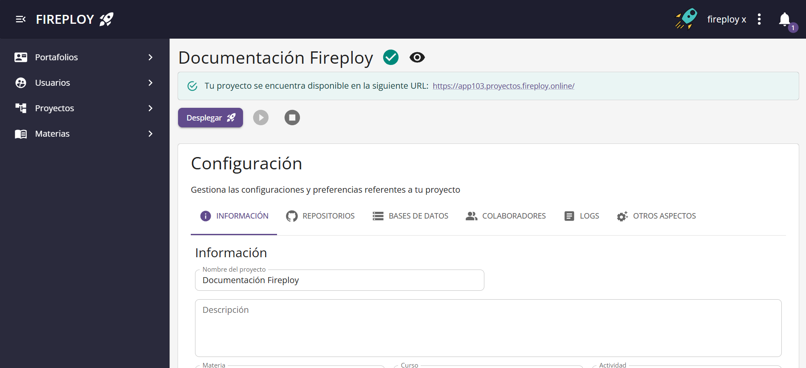
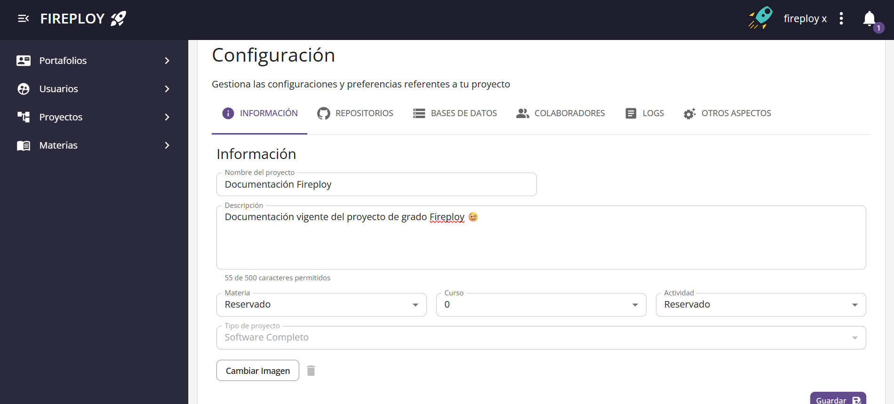
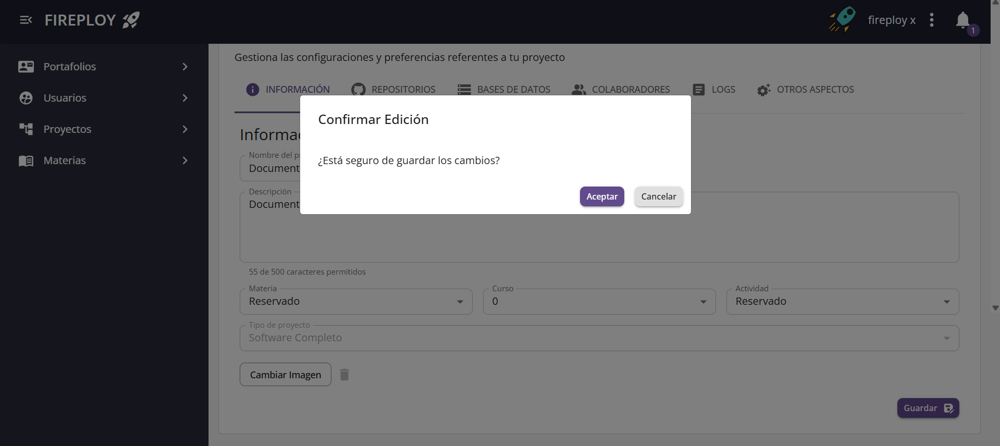
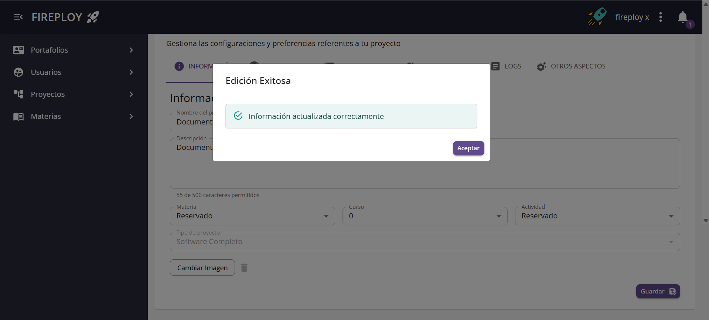

# Información básica

Es la definición del nombre de proyecto y su descripción que será visible para los demás usuarios de Fireploy. Así como la selección de la actividad disponible a la que se encuentra vinculado un proyecto. Estos campos se manejan aparte aparte debido a que pueden describirse sin la necesidad de conocimientos técnicos:

| Nombre del proyecto                                | Descripción | Materia | Curso | Actividad |
| -------------------------------------------------- | ----------- | ------- |-------|-----------|
| Un texto con una longitud máxima de 50 caracteres  | Un texto con una longitud máxima de 512 caracteres   | La materia donde se encuentra el grupo al que se va a vincular el proyecto    | El curso donde se encuentra activa la actividad a la que se va a vincular | La actividad a vincular |

## Modificar los Información básica

1. En la vista de configuración de un proyecto selecciona la pestaña **Información**.

3. Modifica los campos deseados:
    - **Nombre del proyecto**
    - **Descripción**
    - **Materia**
    - **Curso**
    - **Actividad**
    - **Imagen**

4. Haz clic en **Guardar**.

5. Pulsa **Aceptar** en el cuadro de confirmación.  

✅ ¡Los Información básica de tu proyecto han sido actualizados!

:::note Notas
- Los campos obligatorios deben completarse para guardar los cambios.
- Si dejas un campo vacío o introduces un valor inválido, el sistema mostrará un mensaje de error.
- Al cambiar de **curso** o **actividad**, asegúrate de que la combinación sea válida en el contexto académico.
:::
