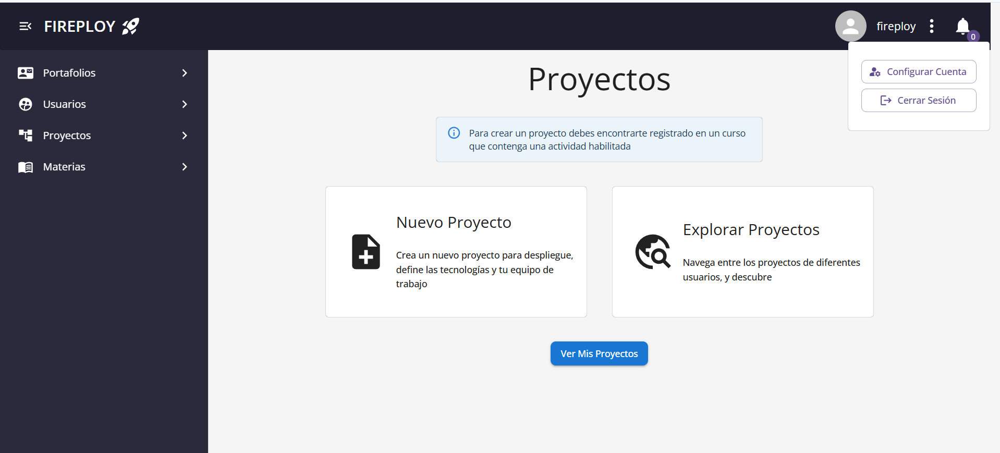
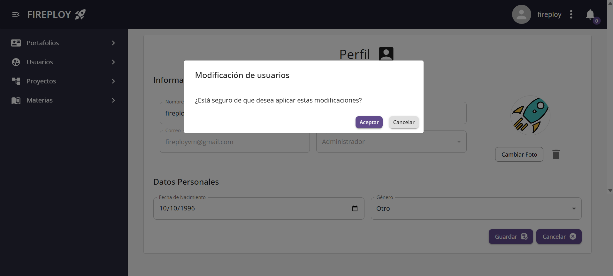

# Visualización y Gestión de Información Personal

Desde tu perfil de Fireploy puedes visualizar y actualizar tu información personal de manera sencilla.

---

## Visualizar tu información personal

1. Asegúrate de estar logueado en tu cuenta.
2. En la parte superior derecha de la pantalla, haz clic en los **tres puntos** que aparecen en tu perfil.

3. Se abrirá un menú con dos opciones:
    - **Configurar cuenta**
    - **Cerrar sesión**
4. Haz clic en **Configurar cuenta**.
5. Accederás a tu perfil, donde podrás visualizar toda tu información personal.

---

## Actualizar tu información personal

### Datos básicos

1. Ingresa a tu perfil a través de la opción **Configurar cuenta**.
2. Modifica los campos que desees:
    - Nombre
    - Apellido
    - Fecha de nacimiento
    - Sexo
    - Foto
3. Haz clic en **Guardar**.
4. El sistema te mostrará un mensaje de confirmación.

5. Pulsa **Aceptar** para completar el proceso.  
    ¡Tu información ha sido actualizada!

:::note Notas
    Si algún campo queda vacío, el sistema te mostrará un mensaje de error indicando que es obligatorio completarlo.
    Si la **fecha de nacimiento** que ingresas es posterior o igual a tu fecha de ingreso a la universidad, aparecerá un mensaje indicando que debes corregir la fecha.
:::

---

### Cambiar foto de perfil

1. En tu perfil, haz clic en la opción **Cambiar foto**.
2. Se abrirá el explorador de archivos.
3. Selecciona la imagen que deseas subir (formatos permitidos: `.jpeg`, `.png`, `.gif`, `.webp`, `.jpg`).
4. La imagen se cargará en la vista previa.
5. Haz clic en **Guardar**.
6. El sistema mostrará un mensaje de confirmación.
7. Pulsa **Aceptar** y tu nueva foto de perfil quedará actualizada.

:::note Notas
    - Si seleccionas un tipo de archivo no permitido, el sistema te mostrará un mensaje de error informándote que el archivo no es válido.

:::

---

## ¿Cómo cancelar los cambios realizados en el perfil?

1. Si hiciste alguna modificación en tu perfil y decides no guardar los cambios, puedes hacer clic en la opción **Cancelar**.
2. La vista del perfil se recargará con los datos originales sin aplicar los cambios.

---

Con estos simples pasos puedes gestionar tu información personal en Fireploy de manera fácil y segura 🚀.
