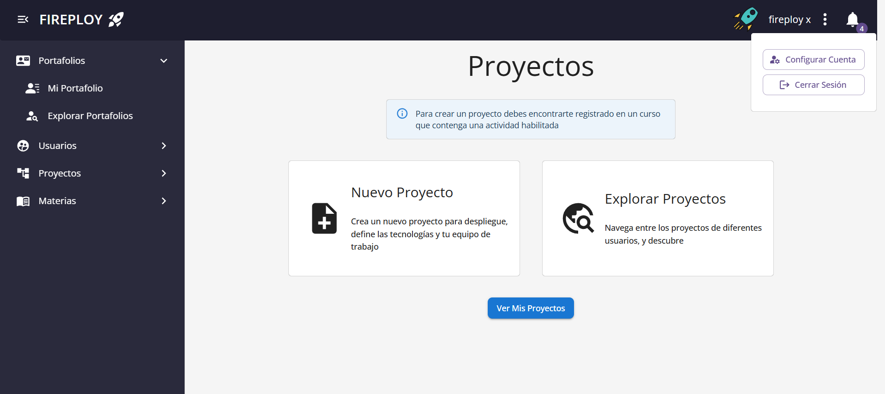

# Cerrar sesión

1. Una vez autenticado, en la parte superior derecha de la plataforma se muestra el **icono de perfil (avatar)**.

3. Pulsa sobre el icono de **tres puntos** para acceder a opciones adicionales.

4. Pulsa sobre **Cerrar sesión**.

5. El sistema cerrará la sesión y redirigirá a la página de inicio de sesión.
