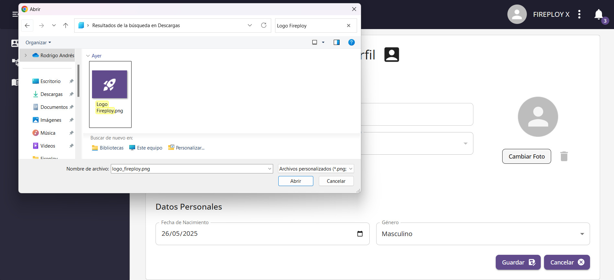

# Perfil

## Visualizar tu información personal

1. Asegúrate de estar logueado en tu cuenta.
2. En la parte superior derecha de la pantalla, haz clic en los **tres puntos** que aparecen en tu perfil.
3. Se abrirá un menú con dos opciones:
    - **Configurar cuenta**
    - **Cerrar sesión**
4. Haz clic en **Configurar cuenta**.
5. Accederás a tu perfil, donde podrás visualizar toda tu información personal.

---

## Actualizar tu información personal

### Campos de información personal

| Campo                           | Descripción                                                                                           |
|---------------------------------|-----------------------------------------------------------------------------------------------------|
| **Nombre**                       | Nombre personal del usuario.                                                                          |
| **Apellido**                     | Apellido personal del usuario.                                                                        |
| **Fecha de nacimiento**          | Debe ser una fecha válida. La edad debe ser como mínimo de 16 años al momento de ingreso a la universidad. |
| **Sexo**                         | Género del usuario.                                                                                   |
| **Fecha de ingreso a la universidad** | Fecha en que el usuario ingresó a la universidad. No puede ser anterior a la fecha de nacimiento ni una fecha inverosímil. |
| **Foto**                         | Imagen de perfil (formatos admitidos: `.jpeg`, `.png`, `.gif`, `.jpg`).                                |

### Pasos para actualizar

1. Ingresa a tu perfil a través de la opción **Configurar cuenta**.
2. Modifica los campos que desees.
3. Haz clic en **Guardar**.
4. El sistema te mostrará un mensaje de confirmación.
5. Pulsa **Aceptar** para completar el proceso.  
    ¡Tu información ha sido actualizada!

:::note Notas
- Si algún campo queda vacío, el sistema te mostrará un mensaje de error indicando que es obligatorio completarlo.
- Si la **fecha de nacimiento** que ingresas es posterior o igual a tu fecha de ingreso a la universidad, aparecerá un mensaje indicando que debes corregir la fecha.
- Las fechas se consideran inverosímiles si no se tiene una edad de al menos 16 años entre la fecha de nacimiento y la de ingreso a la universidad.
:::

---

### Cambiar foto de perfil

1. En tu perfil, haz clic en la opción **Cambiar foto**.
2. Se abrirá el explorador de archivos.
3. Selecciona la imagen que deseas subir (formatos permitidos: `.jpeg`, `.png`, `.gif`, `.jpg`).
4. La imagen se cargará en la vista previa.
5. Haz clic en **Guardar**.
6. El sistema mostrará un mensaje de confirmación.
7. Pulsa **Aceptar** y tu nueva foto de perfil quedará actualizada.

:::note Notas
- Si seleccionas un tipo de archivo no permitido, el sistema te mostrará un mensaje de error informándote que el archivo no es válido.
:::

