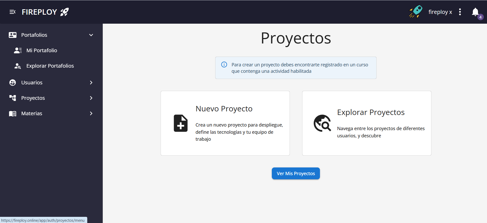
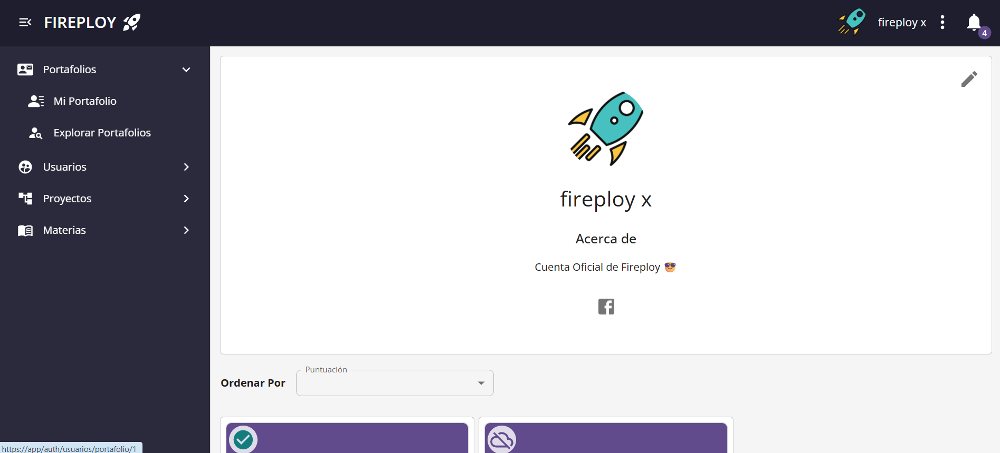
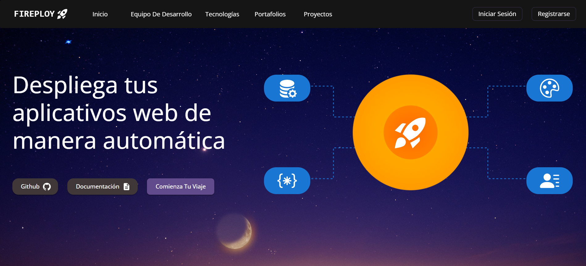
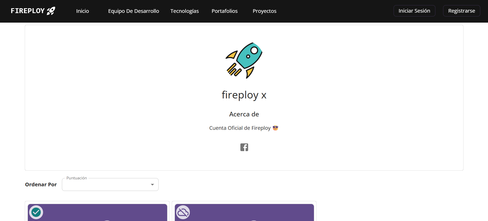
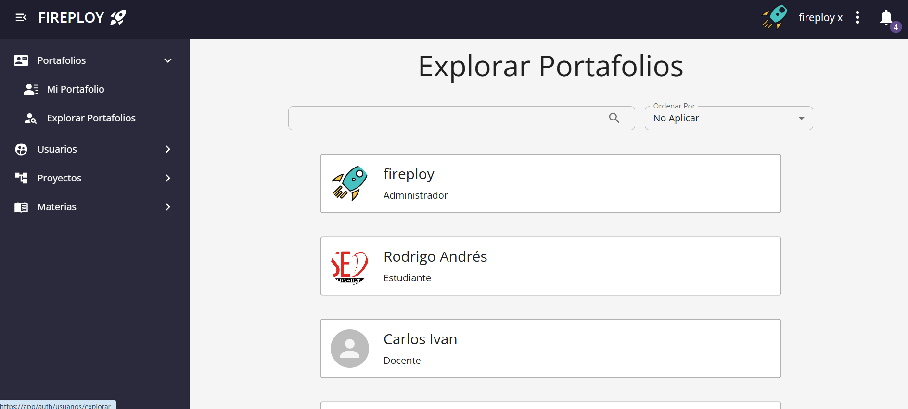
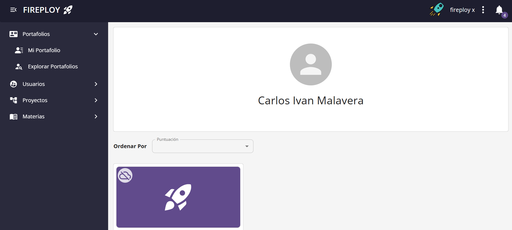

# Visualización

Cada usuario en la plataforma cuenta con un **portafolio personal**, donde puede mostrar su experiencia, habilidades, proyectos y enlaces a redes profesionales.

Los portafolios son públicos, permitiendo que otros usuarios de la comunidad puedan explorarlos, incluso sin necesidad de estar logueados. Esto promueve la colaboración, la visibilidad y las oportunidades entre los miembros de la plataforma.

Además, cada usuario puede editar su propio portafolio desde el menú principal.

---

## Acceso a los portafolios

### Acceso a portafolio propio

1. Desde el menú principal, selecciona la opción **Mi portafolio**.

2. Se abre la página con la información actual de tu portafolio.

### Acceso a portafolio de otro usuario de manera pública

1. Desde la página principal  **Explorar portafolios**.

2. Se abre una página con los **portafolios públicos** de los usuarios de la plataforma.  
Aquí puedes usar la barra de búsqueda o filtros para encontrar el portafolio deseado.

3. Selecciona el portafolio deseado (por ejemplo: *Fireploy*).

4. Se mostrará la información del portafolio seleccionado.

### Acceso a portafolio de otro usuario teniendo una sesión activa

1. Selecciona la opción de  **Explorar Portafolios**.

2. Se abre una página con los **portafolios** de los usuarios de la plataforma.  
Aquí puedes usar la barra de búsqueda o filtros para encontrar el portafolio deseado.

3. Selecciona el portafolio deseado.

4. Se mostrará la información del portafolio seleccionado.

