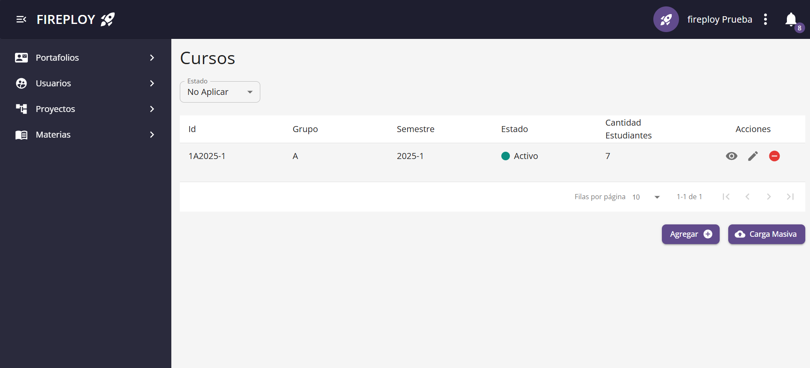
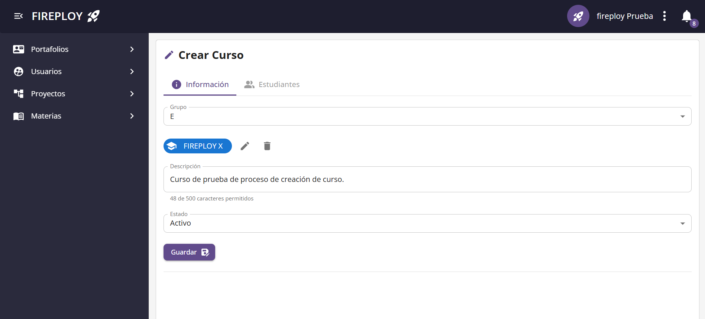
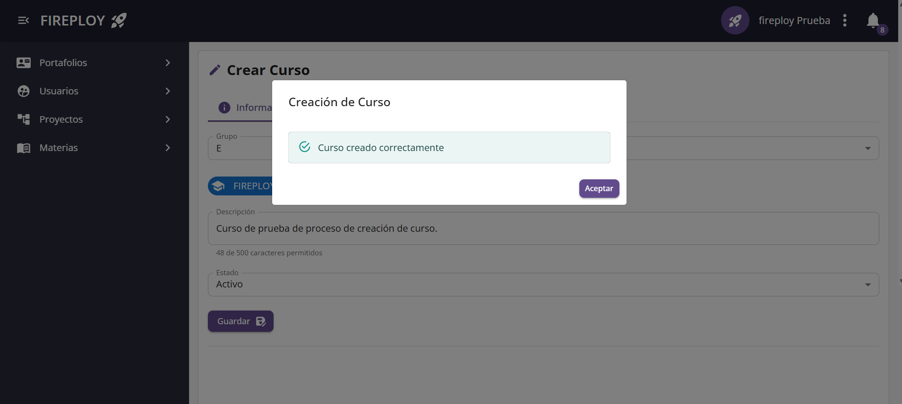

# [ADMIN] Gestión de Cursos

Gestiona los cursos que se encuentran registrados en la plataforma. Estos cursos se asocian a las materias y son administrados por los docentes.

## Crear un curso

El administrador puede crear nuevos cursos de forma individual.

### Pasos para crear un curso

1. Desde la barra lateral, hacer clic en **Materias**.  
2. En la tabla de materias, hacer clic en el botón de **Visualizar** de la materia deseada.  

3. Se abre la vista de la materia con sus cursos.  
4. Hacer clic en **Agregar**.  

5. Se abre la vista de creación de curso.  
3. Completar los campos del formulario, los cuales se explican en [formulario de creación de curso](./index.md#formulario-de-creación-de-curso).  

7. Hacer clic en **Guardar**.  
8. El sistema mostrará un modal confirmando la creación del curso.  

9. El nuevo curso se reflejará en la lista de cursos.  

### Formulario de creación de curso

| Campo         | Tipo de dato    | Obligatorio | Descripción                               |
|---------------|-----------------|-------------|-------------------------------------------|
| Identificador | Texto libre     | Sí          | Nombre o identificador del curso.         |
| Profesor      | Selección (user) | No          | Profesor asignado al curso.               |
| Descripción   | Texto largo     | No          | Descripción breve del curso.              |

---

## Actualizar un curso

El administrador puede actualizar los datos de un curso existente.

### Pasos para actualizar un curso

1. Desde la barra lateral, hacer clic en **Materias**.  
2. En la tabla de materias, hacer clic en el botón de **Visualizar** de la materia deseada.  

3. Se abre la vista de la materia con sus cursos.  
4. En la tabla de cursos, hacer clic en el botón de **Editar** del curso deseado.  
5. Se abre la vista de edición con los datos actuales del curso.  
6. Modificar los campos que se requieran.  
7. Hacer clic en **Guardar**.  
8. Confirmar la acción en el modal.

---

### Habilitar o deshabilitar un curso

El administrador puede habilitar o deshabilitar un curso desde la vista de detalle de la materia en la tabla de cursos.

### Pasos para habilitar/deshabilitar un curso

1. Desde la vista de cursos, hacer clic en el botón de **Habilitar** o **Deshabilitar** correspondiente al curso.  
2. Se abrirá un modal de confirmación.  
3. Hacer clic en **Confirmar**.  
4. El sistema mostrará un modal confirmando la acción.

### Estado esperado en la tabla

- Un curso habilitado se muestra como **Activo**.  
- Un curso deshabilitado se muestra como **Inactivo**.

---

## Carga masiva de cursos

El sistema permite al administrador realizar la carga masiva de cursos mediante un archivo en formato `.xlsx`. Se adjunta un archivo de ejemplo: [Formato_cursos.xlsx](../../../../static/files/formato_cursos.xlsx).

### Requisitos del archivo

- El archivo debe tener extensión `.xlsx`.  
- Las columnas mínimas recomendadas son:  
  - Nombre del curso  
  - Código del curso  
  - Estado (Activo/Inactivo)

:::note Nota

Es importante validar que el archivo no contenga datos duplicados o inconsistencias.

:::

### Pasos para la carga masiva

1. Desde cualquier **Listado de Cursos**, hacer clic en el botón **Carga Masiva** (parte inferior derecha).  
2. Se abrirá el explorador de archivos.  
3. Seleccionar el archivo `.xlsx` con los cursos.  
4. Se abrirá un modal de confirmación.  
5. Hacer clic en **Confirmar**.  
6. El sistema mostrará un modal confirmando la carga.

---
