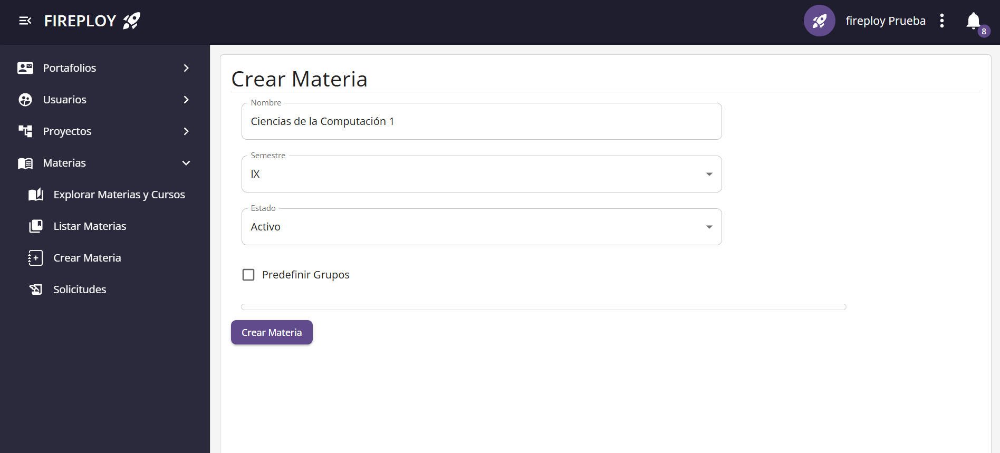
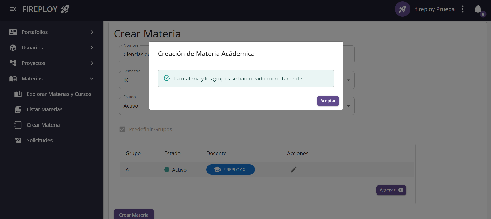
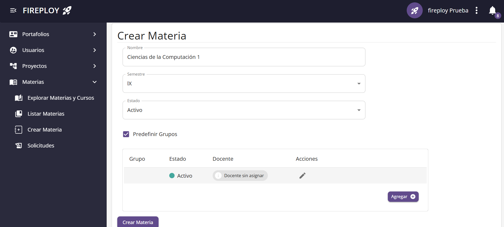
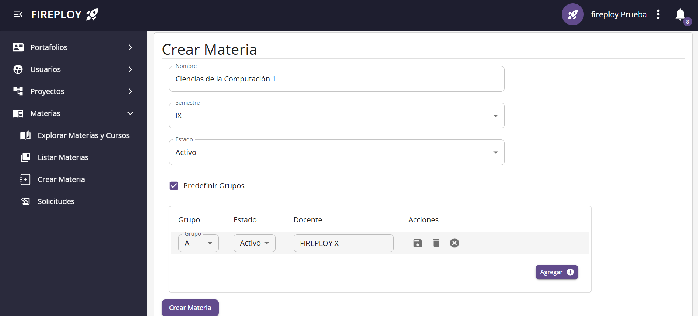
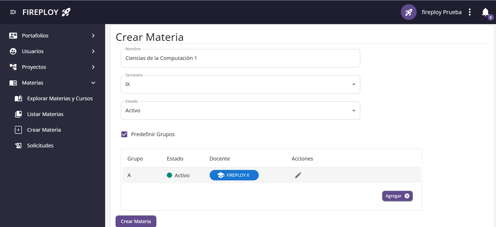
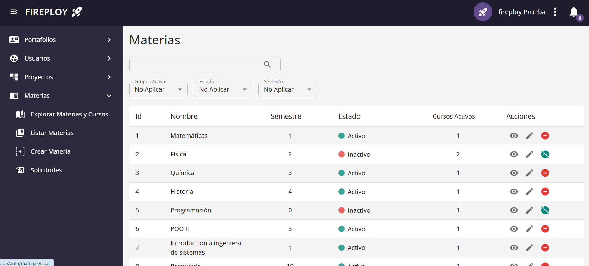
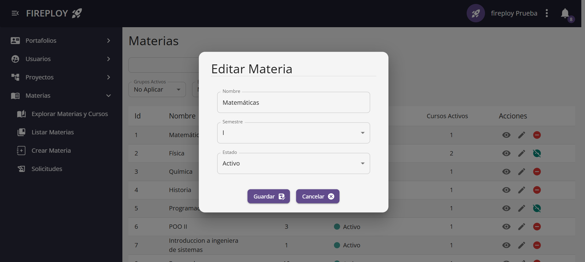
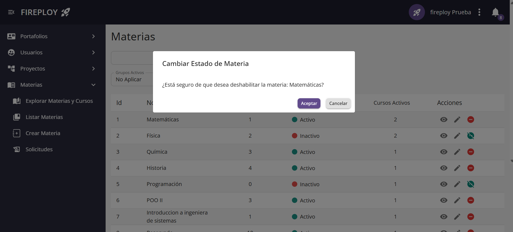
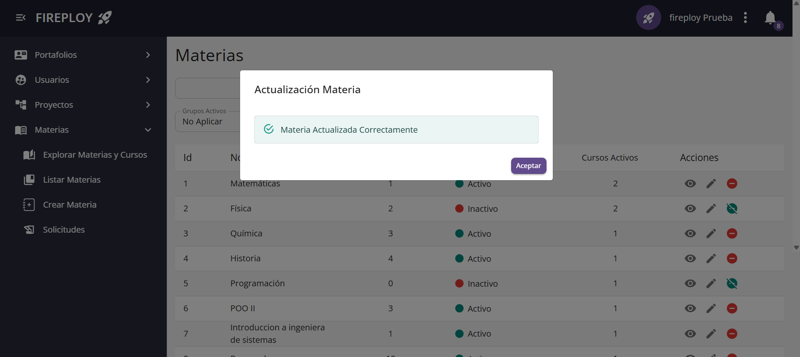
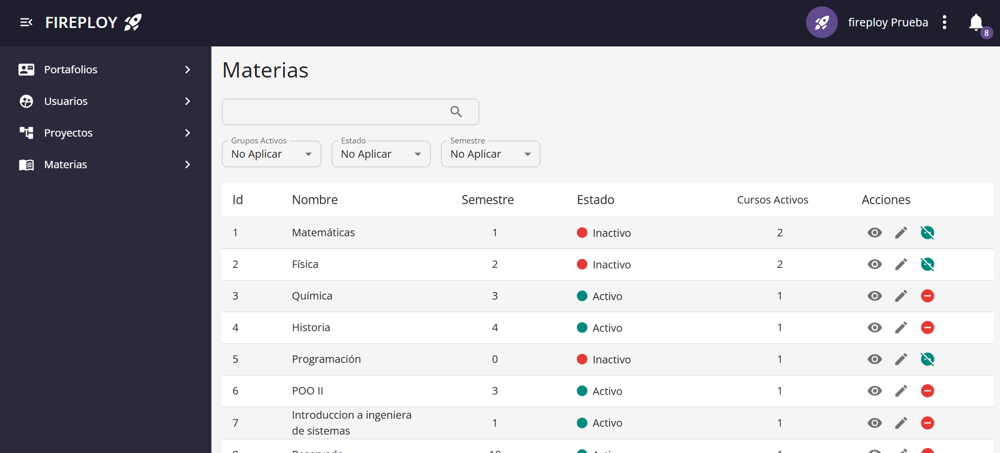

# [ADMIN] Gestión de Materias

Gestiona las materias que se encuentran registradas en la plataforma. Estas materias posteriormente se asocian a cursos y actividades administradas por los docentes.

## Crear una materia

El administrador puede crear nuevas materias de forma individual.

### Pasos para crear una materia

1. Desde la barra lateral, hacer clic en **Materias**.
2. Seleccionar la opción **Crear Materia**.

3. Completar los campos del formulario, los cuales se explican en [formulario de creación de materia](./index.md#formulario-de-creación-de-materia).  

4. Hacer clic en **Crear Materia**.

### Formulario de creación de materia

| Campo             | Tipo de dato    | Obligatorio | Descripción                             |
|-------------------|-----------------|-------------|-----------------------------------------|
| Nombre de materia | Texto libre     | Sí          | Nombre identificador de la materia.     |
| Descripción       | Texto largo     | No          | Descripción breve de la materia.        |
| Estado            | Activa/Inactiva | Sí          | Estado inicial de la materia.           |

#### Definir cursos en creación

Se pueden definir los cursos en este apartado.

1. Da clic en **Predefinir Grupos**

2. Ingresa los datos que desees, y ve guardando la información por fila.

## Actualizar una materia

El administrador puede actualizar los datos de una materia existente.

### Pasos para actualizar una materia

1. Desde la barra lateral, hacer clic en **Materias**.  
2. Seleccionar la opción **Listar Materias**.  

3. En la tabla de materias, hacer clic en el botón de **Editar** de la materia deseada.

4. Se abre un formulario en un modal con los datos actuales.
  
5. Modificar los campos que se requieran.  
6. Hacer clic en **Guardar**.  
7. Confirmar la acción en el modal.

---

### Habilitar o deshabilitar una materia

El administrador puede habilitar o deshabilitar una materia, esto puede hacerse mediante el apartado de edición de materia, al igual de que se cuenta con un atajo en la tabla de **Listar Materias** en el apartado de **Acciones**.

---

## Carga masiva de materias

El sistema permite al administrador realizar la carga masiva de materias mediante un archivo en formato `.xlsx`. Se adjunta un archivo de ejemplo: [Formato_materias.xlsx](../../../../static/files/formato_materias.xlsx).

### Requisitos del archivo

- El archivo debe tener extensión `.xlsx`.  
- Las columnas mínimas recomendadas son:  
  - Nombre de materia  
  - Código de materia  
  - Estado (Activa/Inactiva)

> **Advertencia**  
> Es importante validar que el archivo no contenga datos duplicados o inconsistencias.

### Pasos para la carga masiva

1. Desde la vista **Listar Materias**, hacer clic en el botón **Carga Masiva** (parte inferior derecha).  
2. Se abrirá el explorador de archivos.  
3. Seleccionar el archivo `.xlsx` con las materias.  
4. Se abrirá un modal de confirmación.  
5. Hacer clic en **Confirmar**.  
6. El sistema mostrará un modal confirmando la carga.

---