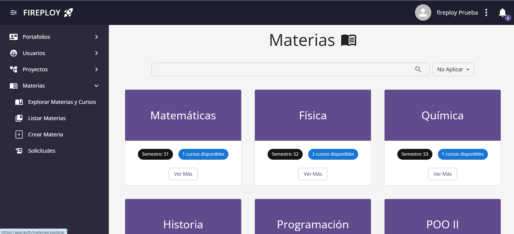
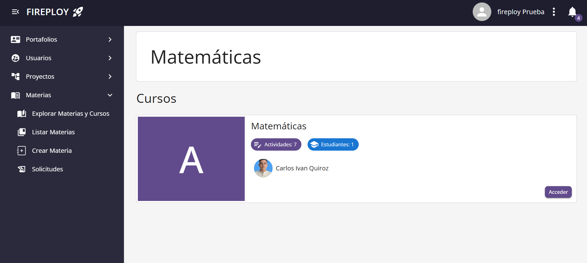
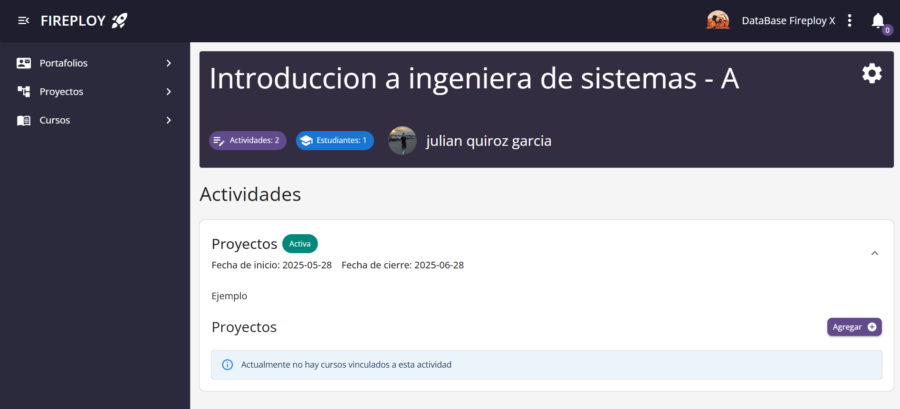

# Introducción

Las materias corresponden a un conjunto de cursos, los cursos son grupos administrados principalmente por un usuario de tipo docente. Son fundamentales para vincular los proyectos de un estudiante con un curso del programa académico de su carrera.

La vinculación de proyectos se realiza a través de **Actividades**, un curso puede tener varias actividades, y un proyecto no puede estar vinculado en más de una al mismo tiempo.

## Explorar las Materias y Cursos

1. Inicia sesión en la plataforma.
2. En el menú principal, haz clic en la opción **Materias**.
3. El sistema te mostrará la página **Explorar Materias**, donde podrás ver todas las materias disponibles.

4. Para ver los cursos simplemente presiona la opción de **Ver Más** de la respectiva materia.

---

## Actividades

Las **actividades** son unidades de trabajo o aprendizaje dentro de un curso.  
Pueden ser clases, talleres, laboratorios, trabajos prácticos, evaluaciones, etc.

Cada actividad incluye la siguiente información:

- **Título:** nombre de la actividad.  
- **Descripción:** detalles sobre el contenido o las instrucciones de la actividad.  
- **Fecha de inicio:** a partir de cuándo está disponible la actividad.  
- **Fecha de fin:** hasta cuándo se puede realizar o completar la actividad.

Además, cada actividad puede tener **proyectos** vinculados, los cuales representan tareas, entregables o desarrollos concretos relacionados con la actividad.

### Visualizar las actividades de un curso:

:::info Requisitos previos
    Se requiere encontrarse registrado en el respectivo curso de las actividades.
:::

1. Sigue los pasos de [Explorar cursos y materias](./index.md#explorar-las-materias-y-cursos).
2. Selecciona el curso que quieres visualizar.
3. En la vista del curso se listarán las actividades asociadas.

:::note Notas:
    - Si el curso tiene actividades, estas se mostrarán con su respectiva información (nombre, descripción, fecha, etc.).  
    - Desde las actividades puedes acceder a los proyectos que están vinculados.  
    - En caso de que un curso no disponga de actividades, se mostrará un mensaje indicando que **no existen actividades actualmente** para ese curso.

:::

### Vincular proyecto a un curso

Puedes vincular tus proyectos a un curso si este tiene una actividad **activa** a la cual puedas relacionar tu proyecto. Esto puede hacerse a través de la modificación de la [información básica de un proyecto](../../proyectos/elementos-de-un-proyecto/informacion-basica/index.md#modificar-los-información-básica).

También puede crearse un proyecto que se vincule de manera directa a la sección seleccionada, esto mediante el botón de **Agregar** que se encuentra al inicio de cada actividad.

