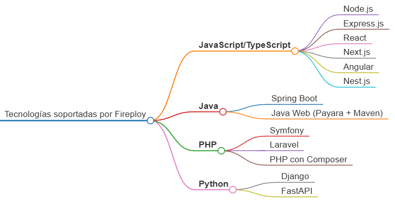
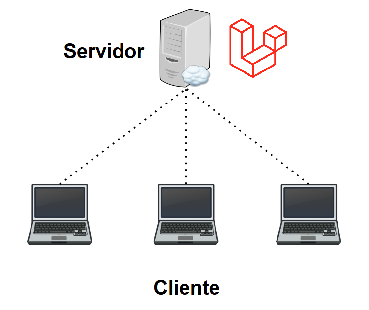

# Tecnologías Soportadas y Tipo de proyecto

Fireploy posee un número limitado de frameworks disponibles para despliegue automático, existen algunas que requieren una sintaxis especial para sus variables de entorno, así como otras difieren en su complejidad de configuración.

### Tecnologías Soportadas

### Tipo de proyecto

Los tipos de proyecto permitidos en Fireploy se catalogan cómo "Dos Capas" o "Software Completo". Definiéndose el primero como aquellos que presenten dos repositorios (uno enfocado al Frontend y otro al Backend).

Por otra parte es "Software Completo", aquel que maneje el concepto de monolito, es decir, tanto su lógica de vistas como backend se encuentren definidos en la misma capa. Un buen ejemplo de esto es un software que maneje estos dos aspectos con **Laravel**:

Si se quiere ser más minucioso en dichas definiciones, estas no se rigen por completo en los conceptos básicos de arquitectura de software, ya que no se contempla la capa de datos. La configuración de esto se aprecia con detalle en el apartado [bases de datos](../elementos-de-un-proyecto/bases-de-datos/index.md)

