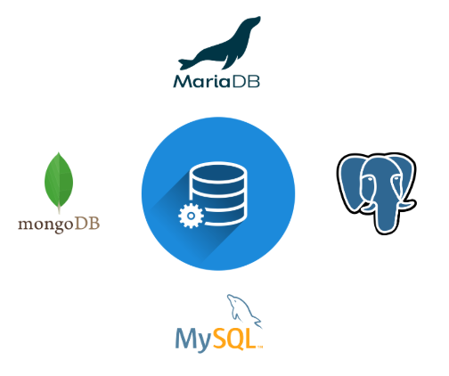

# Bases de datos

Las bases de datos son componentes clave que permiten almacenar, organizar, y gestionar la información que usa la aplicación.

Es indispensable que la base de datos se encuentre configurada en la capa del backend, se entra en detalle en este aspecto en el apartado [configuraciones previas](address).

Fireploy soporta los siguientes motores de bases de datos:

- MySQL
- PostresSQL
- MariaDB
- MongoBD

## Definir base de datos en el aplicativo