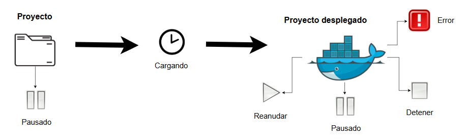
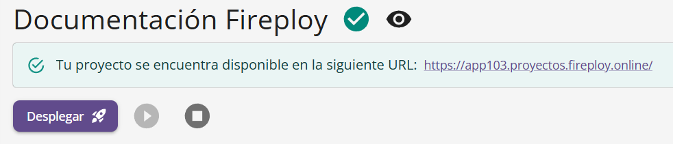

# Estado del proyecto

Los proyectos poseen distinto estados que dependen de la etapa en la que se encuentre el proyecto, esto se refiere a si el proyecto se encuentra ya desplegado o no. Al momento de crear un proyecto este se asume bajo un estado de **pausado**, durante el proceso de despliegue asume el de **cargando**. De ser exitoso el despliegue se transición a **en ejecución**, si no estado **error**. Mientras que cuando un proyecto se encuentra ya desplegado, los estados van acorde a los estados **pausa**, **detener** y **en ejecución** va acorde a su respectivo estado en un contenedor Docker.

### Estados posibles

- Offline
- Cargando
- En línea
- Error
- Pausado
- Detenido

### Representación gráfica de los estados

### La relación de los estados con Docker

Es indispensable que el usuario reconozca que los proyectos se manejan a nivel de despliegue como containers de Docker. Por consiguiente, las modificaciones sobre el estado de un proyecto son las mismas que las del estado de un container Docker. 

:::note Notas

    - Detener conceptualmente implica liberar los recursos del sistema ocupados por el proyecto en ese momento, mientras que pausarlo simplemente para la ejecución pero los recursos del proceso permanecen apartados.
    - Para más información sobre los container de Docker y sus estados visita https://docs.docker.com/reference/cli/docker/container/

:::

### Modificar el estado de un proyecto

La vista de configuración de proyecto dispone de un panel para la gestión de estados de un proyecto. Algunas opciones de estado se bloquean en función del estado en que se encuentre el proyecto.

