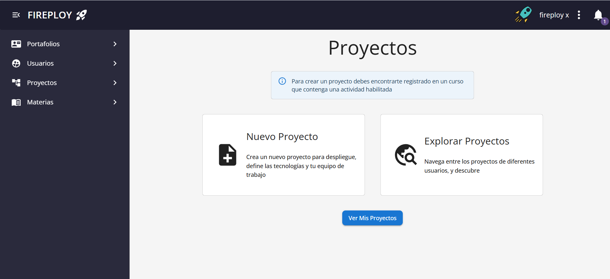
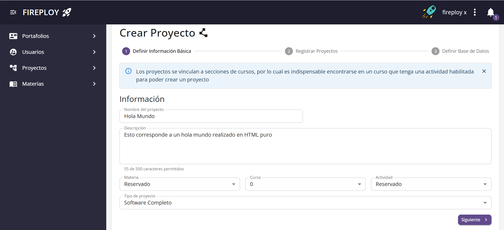
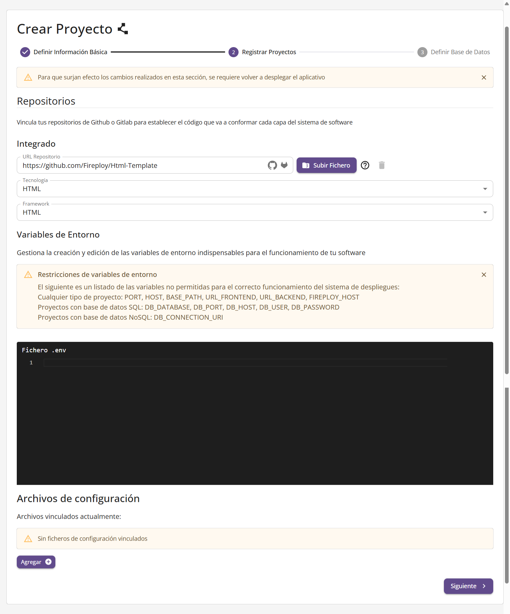
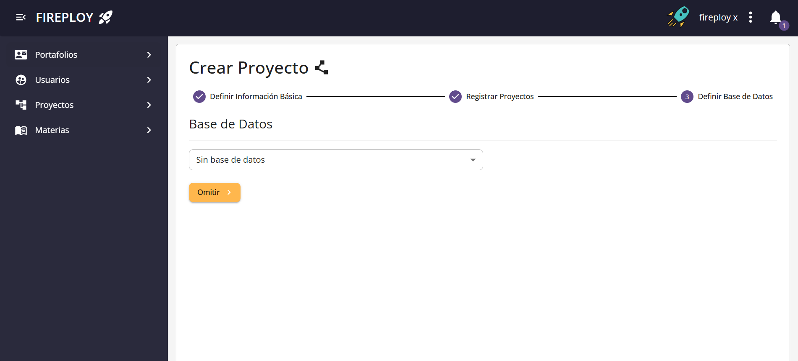
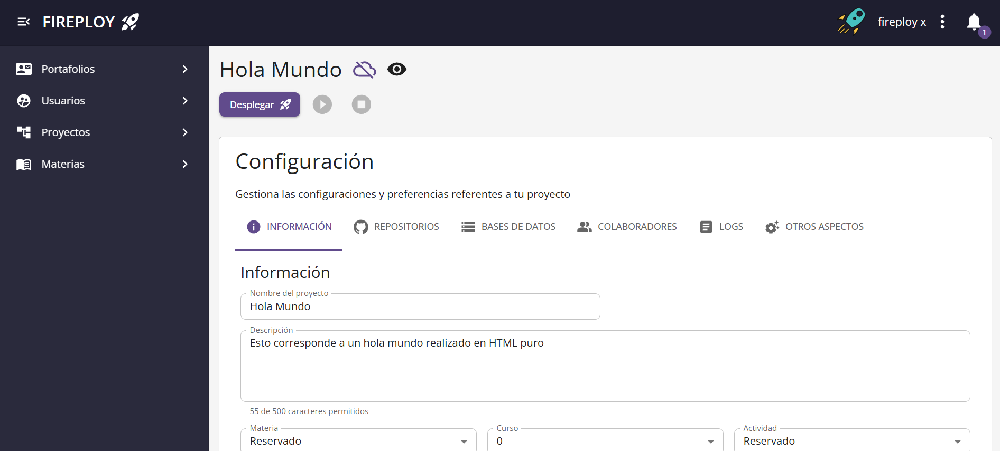

# Gestión de Proyectos en Fireploy

En esta sección aprenderás cómo **crear un nuevo proyecto** y cómo **actualizar la información general de un proyecto existente** en Fireploy.

Los proyectos en Fireploy están vinculados a actividades de un curso, lo que te permite automatizar el despliegue de tus aplicaciones de forma sencilla.

## Crear un Nuevo Proyecto

1. Dirígete al apartado **“Nuevo Proyecto”** en el menú, o selecciona **“Crear Proyecto”** desde el dashboard.

### Paso 1: Información Básica

Completa los campos referentes a los [información básica de un proyecto](/docs/usuario-general/proyectos/elementos-de-un-proyecto/datos-basicos/index.md).

Haz clic en **“Siguiente”**.

### Paso 2: Configuración del Repositorio

Completa los campos referentes a los [repositorios](/docs/usuario-general/proyectos/elementos-de-un-proyecto/repositorios/index.md).

Haz clic en **“Siguiente”**.

### Paso 3: Configuración de Base de Datos

Si tu proyecto no requiere base de datos:

1. Haz clic en **“Omitir”**.

Si requiere base de datos, agrega la información de la base de datos, para más detalles visita: [definir base de datos en el aplicativo](/docs/usuario-general/proyectos/elementos-de-un-proyecto/bases-de-datos/index.md/#definir-base-de-datos-en-el-aplicativo).

### Finalizar Creación

1. Revisa el resumen de tu proyecto.
2. Haz clic en **“Aceptar”**.

El proyecto se creará y serás redirigido a la página de gestión del mismo.

:::note Notas

- Los campos obligatorios deben completarse para poder continuar al siguiente paso.
- Puedes omitir variables de entorno y ficheros si no son requeridos para el tipo de proyecto.
  :::

## Actualizar Información de un Proyecto

Los procesos de modificación de datos son detallados en los respectivos apartados de cada uno de los atributos de proyecto mencionados en **elementos de un proyecto**

:::note Notas

- La gestión de proyectos te permite actualizar, modificar y adaptar la información asociada a tus aplicaciones solo mientras el proyecto no se encuentre en un estado diferente a en línea, para más información de estados visita: [estados de un proyecto](/docs/usuario-general/proyectos/elementos-de-un-proyecto/estado/index.md).
  :::

---

Con estos simples pasos puedes gestionar tus proyectos en Fireploy de forma ágil y eficiente 🚀.
