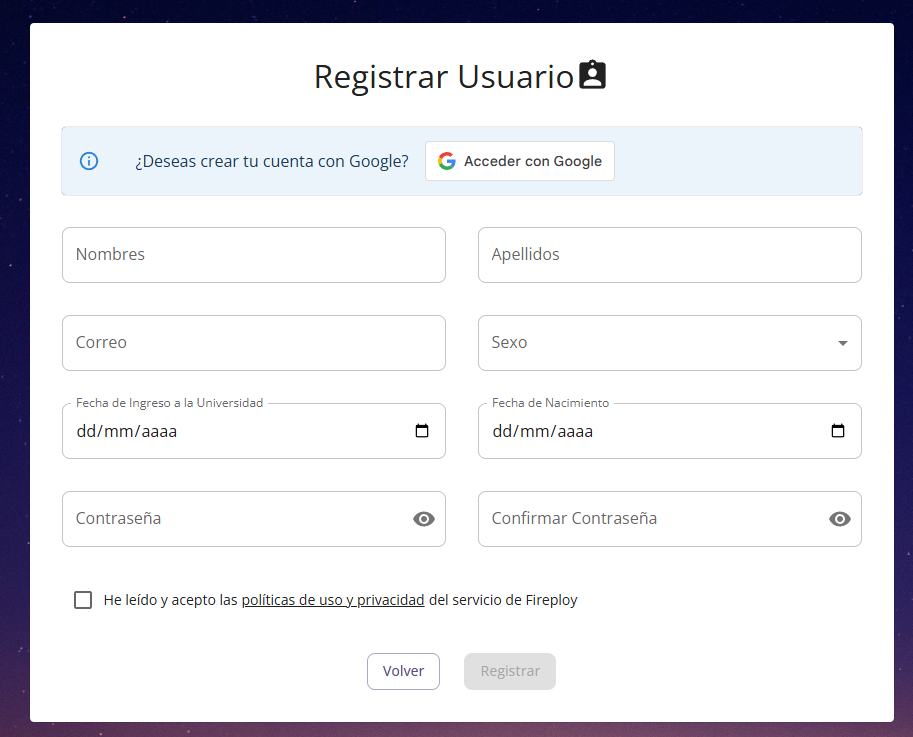
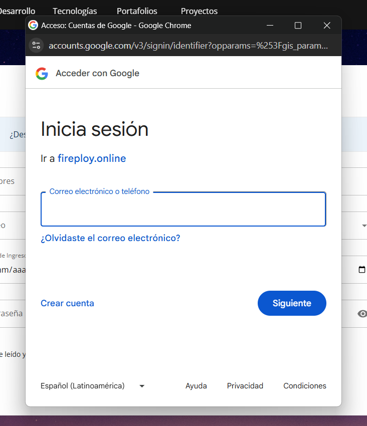

# Registro

Se permite a cualquier persona el registro en la plataforma, ya sea mediante un formulario de registro propio o usando el servicio de autenticación de Google Account.

Para este proceso es indispensable conocer con anterioridad las [políticas de servicio](../politicas-servicio/index.md) de Fireploy.

Nos situamos en el apartado de **Registro**, el cual es accesible través de la opción registro que se encuentra en la vista de **iniciar sesión**. 

## Formas de registro

### A. Registro mediante Fireploy

El formulario de registro del aplicativo consta de los siguientes elementos:

| Campo                             | Parámetros / Reglas de validación                                          |
| --------------------------------- | -------------------------------------------------------------------------- |
| Nombre                            | Texto, requerido                                                           |
| Apellido                          | Texto, requerido                                                           |
| Correo electrónico                | Formato válido de email, requerido, único                                  |
| Sexo                              | Lista desplegable: Femenino, Masculino, Otro                               |
| Fecha de ingreso a la universidad | Fecha, no puede ser anterior a la fecha de nacimiento                      |
| Fecha de nacimiento               | Fecha válida                                                               |
| Contraseña                        | Mínimo 8 caracteres, debe contener al menos 1 número y 1 carácter especial |
| Confirmar contraseña              | Debe coincidir con la contraseña ingresada                                 |
| Políticas de uso y privacidad     | Aceptación requerida (checkbox)                                            |

Al confirmar, se finaliza el registro y se redirige al menú principal.

### B. Registro mediante Google Account

El usuario selecciona “Registrarse con Google”.

Se despliega la ventana de selección de cuenta.

El usuario elige cuenta, posteriormente se le solicita completar los datos adicionales (fecha de ingreso, nacimiento, sexo).

---

Una vez realizado esto podemos empezar a disfrutar de Fireploy 😎
